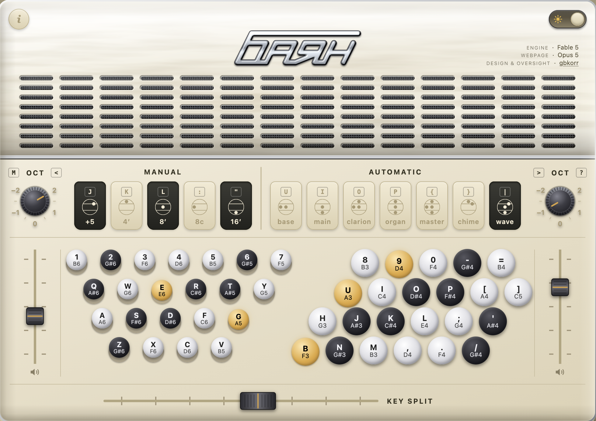
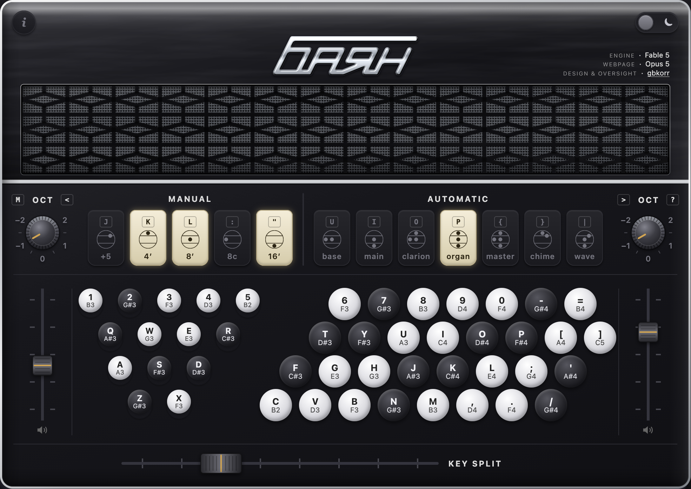

I've found it difficult to come up with articles to write about vibe-coded projects. A lot of my motivation and excitement to explain a piece of software comes from my love of the code— this whole blog was started to give me a place to talk more about how my code works after enjoying that in my [rcade](https://gbkorr.github.io/rcade) documentation project. With that gone (the nuance and structure of code really isn't a relevant part of vibe development), I'm left with... the software itself, and the story of how I made it. 

But that story isn't very interesting. Programming often came with excitement and drama— realizing that an approach wouldn't work, tracking down an insidiously hidden bug[^app]— and those sorts of experiences were what made development memorable. Now it's just "hey Claude, this doesn't work, take a look and try to fix it." The whole personal attachment is gone.

And the software itself? Yeah, it's valuable to have a human write about how to use it (AI can't experience UX, sort of), but that kind of thing belongs in the readme, not a blog.

[^app]: I wrote a whole college application essay about one of these; it really stuck with me.

---

So anyway, here's one of the more interesting things I made this month. I've continued to pursue neat projects, but they just haven't felt as meaningful... and I haven't had much inspiration to write. Tough times.

# The [Web-Bayan](https://gbkorr.github.io/gbkorr/bayan/bayan.html)

I'd been listening to a lot of [bayan](https://en.wikipedia.org/wiki/Bayan_(accordion)) accordion [music](https://www.youtube.com/watch?v=pOAuR_UdA-U) this summer and had the idea to practive UI/UX/web vibe development by making a website that simulates the interface of the instrument. This would have the added benefit of giving me some practice and enjoyment playing the instrument before I buy one. I'd always wanted to make some web interfaces for instruments (I have a lot of world instrument experience), but never had the synthesizing background to make it happen.

Unlike most European accordions, the bayan uses a button layout (far superior, imo) rather than a piano keyboard, and it happens to be organized with a stagger very similar to a computer keyboard. Making a website interface for a button accoridon isn't a new idea[^ex]^,^[^ex2], but I figured that with the power of vibe coding I could make a better one. Besides, those were regular old chromatic accordions— not bayans! The differentiating factor ended up being that I included a free bass system for the left hand, and I think my website has better polish/UX/timbre.

[^ex]: https://www.keyboardaccordion.com/chromatic
[^ex2]: https://okathira-dev.github.io/client-web-api-sandbox/button-accordion-with-keyboard/index.html

Developing this was an interesting process— I intentionally chose a hands-off approach where I made Claude do all the technical work, and kept my role as purely the designer. Of course, this involved lots of designing— loads of back-and-forth timbre feedback to get it tuned right, and 90% of the interface was by my own design. Both the sound engine and the web design took a lot of polishing and tweaking to get to my liking. I did the overall layout too— I actually gave Claude a hand-drawn sketch of the layout I wanted, and to my surprise it interpreted it perfectly and even read the wonky, faint handwriting of my labels and notes.

You can try it out [here](https://gbkorr.github.io/gbkorr/bayan/bayan.html).

## Cut/Experimental Features
There are a few features I haven't really settled on yet.

- **Stradella bass for the left hand**: it's very easy to make the left hand buttons play chords following the traditional modified stradella bass system found on bayans (most of which have a toggle between this mode and the free bass (one note per button) system). Unfortunately I lack the musical experience to test this properly! Chords break my brain. I'll probably get this system up and running at some point in the future.

- **Bellows shake and swell**: I've yet to figure out a good way to control the note dynamics— how loud the instrument is based on how hard the bellows are squeezed. This is where a lot of expression comes from when playing the accordion, so it's very important— but it's a very analog and unique technique and I haven't figured out a good way to simualte it yet.

- **MIDI playing**: I got a fully-featured midi player working that uses a midi file to synthesize the notes and highlights the keys as they're played. I ended up just not seeing the need for such a feature, and the midis I was using were lackluster. I should probably put it back in, though.

- **Bass register switches**: I should find a way to put these back in. I originally cut them since they added a bit too much user complexity ("how do I know what will sound good?" The melody register switches are already a lot), but the current bass timbre only sounds good with some of the melody registers.

