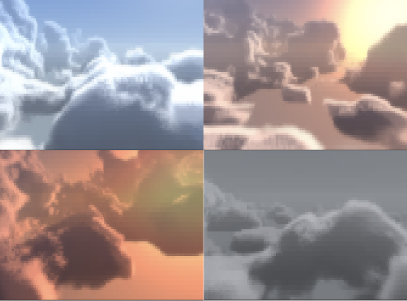
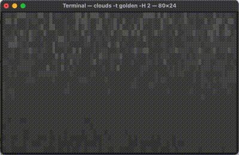
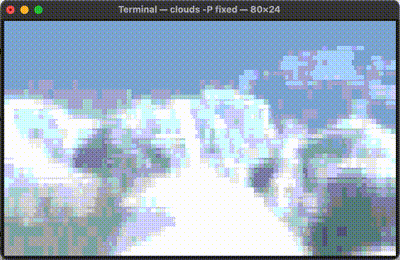
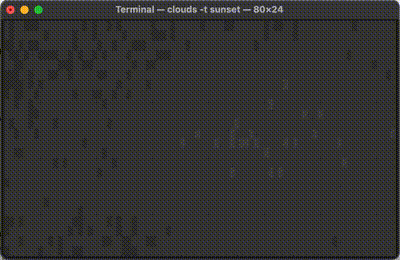

Here's a little project I cooked up with Claude Fable over the course of about two weeks. Like my other projects with Claude, I led the design and iteration and had Claude do the technical implementation.

I've always enjoyed terminal screensavers like cbonsai and pipes.sh, but my background in R never gave me an opportunity to make my own— I'm just not great at writing in C. That made this a particularly good project to vibecode— I know how the renderer works, but wouldn't have been able to get the volumetric logic running in C on my own (in a reasonable amount of time to make it worth doing as a project).

github: [https://github.com/gbkorr/clouds.c](https://github.com/gbkorr/clouds.c)


## Basic Usage
The program is relatively feature-rich, and has quite a number of useful parameters.


Cloud Generation:    
`--coverage`: Cloud sparsity.      
`--height`: Cloud height; heigh values make for huge, billowing clouds.    

Environment:  
`--time`: Time of day; determines colors and sun elevation.  
`--preset`: Settings preset. See [§presets](#presets).  
`--azimuth`: Horizontal (compass) sun angle; influences the direction of shading on the clouds. 

Animation:  
`--wind`: Speed of cloud movement.   
`--elevation`: Camera Y position; 0.5 is at cloud level, so you can be above or below.  
`--yaw`: Initial yaw angle, useful for looking into/away from the wind.  
`--pitch`: Initial pitch angle.  

Quality:   
`--quality`: Number of raymarch steps. >60 not recommended unless prerendered with --loop.  
`--color`: truecolor/256 ansi/mono color.  
`--ascii`: Enable ASCII mode, not my favorite.  
`--ramp`: Glyph ramp (transparent -> opaque) for ASCII rendering.  
`--fps`: Desired frames per second; important for --loop.  

Utility:  
`--interactive`: Enable flight. See [§flight](#flight).  
`--once`: Render a single frame.  
`--loop`: Prerender this many seconds, and loop playback. See [§prerendering](#prerendering).  
`--output`: Save `--loop` prerender to a file.  
`--file`: Play saved file.  



## Flight!
Since the program already listens for keypressed to exit, interactive keyboard controls were a tiny addition. The arrow keys make you look around, and in `--interactive` mode, you fly in the direction you're facing! In this mode `-w` controls your flight speed.


## Prerendering
Volumetric rendering is computationally expensive, and you don't really want a screensaver making your CPU chug. I came up with a simple solution: just prerender a set number of frames and then loop them. This comes with the added benefit of being able to save the frames to play later.

30 fps 4-second looped animation:
```sh
./clouds --loop 4 --fps 30
```

Export to file and play file:
```sh
./clouds -loop 4 --fps 30 -o demo.clouds
./clouds --file demo.clouds
```
## Colors
The project also supports a 256-color fallback for terminals without truecolor (or select it manually with `--color 256`). This color banding on this is GNARLY, I think I like it even more than truecolor.





## Web Demo
Because it's 2026, I was able to make a webdemo in 10 minutes with a quick oneshot prompt to "compile it to WASM and make a drop-in iframe". So now you can pull it up in a browser window if you don't feel like compiling for use in the terminal[^but].

[^but]: Of course, it's still a project designed for the terminal and this web version won't be getting any updates. But it's cool to have.

[`https://gbkorr.github.io/gbkorr/clouds/clouds.html?ARGS`](https://gbkorr.github.io/gbkorr/clouds/clouds.html)

ARGS has format e.g. `clouds.html?coverage=0.5&elevation=0&ascii=true`. color, loop, presets, and interactive mode aren't implemented. Use `ctrl +/-` to increase/decrease resolution. I recommend zooming in a bit or making your browser window small, since it's not designed to look good at super high resolution.

```{=html}
<div style="width:600px;height:400px;background:#000;display:grid;place-items:center">
  <button style="font:600 24px sans-serif;padding:16px 40px;cursor:pointer" onclick="this.outerHTML='<iframe src=https://gbkorr.github.io/gbkorr/clouds/clouds.html?time=sunset&elevation=0.7 width=600 height=400 style=border:0;background:#000 title=clouds></iframe>'">
    load demo
  </button>
</div>
```


