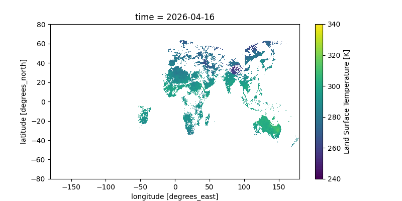

## Big Picture

I think it's really neat that we, as random citizens, have access to (almost) **live visual data from satellites**. I wanted to make a tool to demonstrate this, and to practice some basic full-stack development.

This set of buttons below takes coordinates (or your own location, if you select `Autofill`)[^safety] and uses data from a satellite cluster to **estimate the temperature** from an hour or so ago in that location.

[^safety]: All personal location info is handled client-side, so your location never leaves your computer. Fear not!

The satellites cannot estimate temperature when a location has cloud cover; if it was cloudy when the measurement was taken, the tool will say so.

```{=html}
<script type="module" src="https://pyscript.net/releases/2026.3.1/core.js"></script>
<py-config style="display: none">packages = ["xarray","h5netcdf","h5py","matplotlib"]</py-config>

<script>
//export simple JS function to return geolocation
function get_geolocation(){
    return new Promise((resolve, reject) => {
        navigator.geolocation.getCurrentPosition(
            pos => resolve(pos),
            error => reject(error)
        );
    });
}
</script>
<script type="py">
    import xarray #process netcdf
    from pyodide.http import pyfetch #make http requests
    from pyscript import display #write to webpage
    from js import document, window, get_geolocation #interact with webpage
    import re #regex
    import matplotlib.pyplot as plt #plot

    #keeping this off during development to avoid unnecessary Vercel queries
    deployed = True

    #get html elements
    stdout_div = document.getElementById("stdout")
    button = document.getElementById("button")
    lat_input = document.getElementById("lat")
    lon_input = document.getElementById("lon")

    #print to div
    def stdout(str): stdout_div.innerHTML = str
    #it would be easier to use pyscript.display(), but this doesn't support printing the degrees° symbol

    #fetch .nc file from Vercel
    stdout("Retrieving satellite data...")
    try:
    	if (deployed): response = await pyfetch("https://gbkorr-clms-temperature.vercel.app/api/get_s3") 
    	if not response.ok: raise Exception()
    except:
    	stdout("Failed to retreive satellite data. Sorry :(")
    raw = await response.bytes()
    stdout("Satellite data loaded.")

    #write to script filesystem
    with open('data.nc', 'wb') as file: file.write(raw) 

    #open and read file
    data = xarray.open_dataset('data.nc', engine="h5netcdf")
    
    #plotting this nc file raw; I didn't have to add any of this info!
    df = data['LST'].isel(time=0,lat=slice(0, None, 10), lon=slice(0, None, 10))
    fig, ax = plt.subplots(figsize=(8, 4))
    df.plot(ax=ax, cmap='viridis', vmin=240, vmax=340)
    display(fig, target="plot")

    #enable button
    button.disabled = False
    button.style.backgroundColor = '#0d6efd'
    button.innerText = 'Get Temperature!'

    def to_F(K): return(K * 1.8 - 459.67)
    def to_C(K): return(K - 273.15)
    def get_temperature(nc,lat,lon): return(float(data['LST'].sel(lat=lat,lon=lon,method="nearest")))
    
    async def autofill(event):
        pos = await get_geolocation()
        lat_input.value = pos.coords.latitude
        lon_input.value = pos.coords.longitude

    async def temperature_button(event):
        if (lat_input.value == '' or lon_input.value == ''): 
            stdout('No coordinates provided.')
            return
        
        temp = get_temperature(data,lat_input.value,lon_input.value)

        #check if NaN
        if (temp != temp): temp = "Cloudy."
        else: temp = f"{round(to_F(temp))}&deg; F ({round(to_C(temp))}&deg; C)"
        stdout(f"Satellite: {temp}")

</script>
    
<div>Input coordinates:</div>
<input id='lat' size="4" placeholder="Lat"></input>, <input id='lon' size="4" placeholder="Lon"></input> / <button id="autofill" py-click="autofill" style="background-color: lightgray">Autofill</button>
<br>
<button id="button" py-click="temperature_button" class="btn btn-primary" disabled=true style="background-color: grey; margin-top:5px">Loading...</button>
<div id='stdout'>Loading Python frontend...</div>
<div id='plot'><style>#plot img { width: 600; height: auto}</style></div>
```


## The Data

At this moment, there are over **10,000 satellites** orbiting the Earth performing various roles. Some of these record sensory data, and of these, a handful are made available to the public, like those in the [**Copernicus ecosystem**](https://dataspace.copernicus.eu/) of the ESA (European Space Agency).

**Sensory data from satellites** can be quite a valuable asset—especially if it can be recorded with high time resolution (i.e. images more than once every few days)—and many such satellites focus on acting as a [paid service](https://space-solutions.airbus.com/imagery/our-optical-and-radar-satellite-imagery/pleiades/) for government programs, boasting high-resolution images almost hourly.

Some satellites, though, were **launched in the name of Science**— and as it goes in the study of the Earth and Cosmos, there's little reason (and demand) to charge for these scientific measurements. Satellites launched as part of the ESA's Copernicus Program are one such group, and cover a **variety of sensory modes**, including full RGB images of the Earth's surface assembled every three by the Sentinel-2 mission.

Copernicus makes its data conveniently **available for free online** through several means. Most of these means—like a [webpage](https://browser.dataspace.copernicus.eu/) that allows users to select and download specific sensory measurements for a given area and time—are built on the core data-providing service of an s3 bucket in which all processed Copernicus measurements (fancy image files) are stored. 

To my understanding, an s3 bucket is a **simple cloud storage server** provided by the Amazon Web Services (AWS) ecosystem which essentially just serves static files, and can be navigated much like a regular filesystem. Copernicus exposes theirs to the public— instead of having to middleman through one of their webservices, we can just **download data directly** from the s3 bucket! Copernicus's [documentation](https://documentation.dataspace.copernicus.eu/APIs/S3.html) for this isn't great, but s3 buckets are super simple and easy to use.

### Satellite Imagery

These satellites manage to do a lot with **just image data**. By using different filters (including those off the visual spectrum), different satellites can capture not just RGB images of the Earth but also estimate vegetation cover, humidity, surface temperature, and identify water features and clouds.

This project focuses on [Land Surface Temperature](https://climate.esa.int/en/projects/land-surface-temperature/), which isn't the same as the everyday air temperature we usually use— but it's often pretty close.

### The Satellites

The satellites in question providing our data here are surprisingly hard to find info on. It's a constellation (group of satellites in a pattern around the earth to provide consistent coverage) in geostationary orbit, so the satellites permanently stay in the same spot above the Earth's surface. Infrared measurements are presumably gathered from the satellites and stitched together before (or after) being processed into LST. 

### CLMS

Anyway, the Copernicus Land Monitoring Service ([CLMS](https://land.copernicus.eu/en/about)) is one of the services provided by Copernicus, the organization which collects and processes this data and **makes it available to the public**. Copernicus generally deals with data from the ESA's satellites, but it seems it might also use other organizations' data (e.g. from NASA) for some projects.


## The Backend

### S3 Access
Following [their guide](https://documentation.dataspace.copernicus.eu/APIs/S3.html), we can download data from the s3 bucket by signing up for free credentials from the Copernicus website. Amazon provides a wealth of tools to accomplish this from whatever language fits your needs[^interesting]. 

[^interesting]: Learning about AWS for this project, it's quite interesting that this company provides such services. I wonder if the goal is to use Amazon's wealth to improve global efficiency, or to achieve technological dominance wherein great amounts of organizations rely completely on it. 

I looked around the bucket a bit by running `aws s3 ls` in my terminal until I found the path to the hourly temperature data. Conveniently, the file is located and stored in such a way that we can **query it procedurally** by just knowing the date and time! Good on them. 


:::{.callout-tip title='Path Structure' collapse='true'}

`s3://eodata/CLMS/bio-geophysical/land_surface_temperature/lst_global_5km_hourly_v2`**/YYYY/MM/DD/**`c_gls_LST_`**YYYYMMDDHHHH**`_GLOBE_GEO_V2.2.1_nc/`

Where HHHH is the (military) hour, e.g. 1300 for 1:00 PM.

There's also plenty of ways to grep these files or find the most recent, but this approach is most convenient.
:::


### Vercel and FaaS
I need this webpage to be able to retrieve the satellite data. I could easily set up a server running on my computer that performs the necessary retrieval, but I **don't feel like keeping a server up 24/7**. Luckily, there's a much easier option.

Because of how basic S3 retrieval is, we only really need one simple function to run to get it. Instead of running my own server to perform this function when the user loads the webpage, we can use an external service to **host just the function**— when I query its url, it will run the function once and send back whatever it spits out. This is called Faas—Functions as a Service—and it's a common use case for simple retrieval backends like these.

You can set up FaaS with [AWS itself](https://aws.amazon.com/lambda/), but it's a bit involved; I went with the better option of using [Vercel](https://vercel.com/docs/functions), which runs off of AWS but **streamlines out a lot of the details**. Both have generous free plans for individuals— it doesn't cost them much to run a random function every so often for someone's website that's rarely visited.

To do this, I set up a free "hobby"-level Vercel account and created a new project on the website[^extra]. There were several options for how to proceed, but I decided to do everything through the **Vercel CLI tools** locally on my computer, since the project was so simple. I installed those, created a new folder, and ran the tools to associate that folder with my project. Then *all I had to do* was make a file `folder/api/get_s3.py` (and run a vercel command to deploy), and now whenever anyone visits `https://gbkorr-clms-temperature.vercel.app/api/get_s3`, Vercel runs `get_s3.py` and sends back the output!

[^extra]: And used the settings to change the project name and URL, though that's technically not necessary.

### The S3 Script
`get_s3` is just a simple script that requests the latest file from the S3 bucket and streams it back, using Python's **dedicated `boto3` library** for working with S3.

:::{.callout-tip title="get_s3.py" collapse='true'}
```python
from http.server import BaseHTTPRequestHandler
import boto3
from botocore.config import Config
import datetime

class handler(BaseHTTPRequestHandler):
  def do_GET(self):
    s3 = boto3.client(
      's3',
      endpoint_url = 'https://eodata.dataspace.copernicus.eu',
      aws_access_key_id = '<ACCESS KEY FROM COPERNICUS>',
      aws_secret_access_key = '<SECRET KEY FROM COPERNICUS>',
      config = Config(s3 = {'addressing_style': 'path'})
    )
    
    t = datetime.datetime.now(datetime.UTC) #get current time
    buffer = 60 - t.hour #minutes remaining in hour
    t = t.replace(hour = t.hour - 1) #look at the last hour
    filecode = t.strftime("%Y%m%d%H00") #time info in file
    pathcode = t.strftime("%Y/%m/%d") #time info in bucket path
    
    file_obj = s3.get_object(
      Bucket = 'eodata',
      Key = f'CLMS/bio-geophysical/land_surface_temperature/lst_global_5km_hourly_v2/{pathcode}/c_gls_LST_{filecode}_GLOBE_GEO_V2.2.1_nc/c_gls_LST_{filecode}_GLOBE_GEO_V2.2.1.nc'
    )

    self.send_response(200)
    self.send_header('Content-type', 'application/x-netcdf')
    self.send_header('Content-Disposition', 'attachment; filename="data.nc"')
    self.send_header('Access-Control-Allow-Origin', '*')
    self.send_header('Cache-Control', f's-maxage={buffer * 60}') #cache for the rest of the hour
    self.end_headers()
  
    #stream response
    for chunk in file_obj['Body'].iter_chunks(chunk_size=4096):
      self.wfile.write(chunk)
```
:::


## The Frontend
This webpage was created with [Quarto](https://quarto.org/), a clean markdown renderer based on Rmarkdown, and running a block of HTML near the beginning to work with the satellite data.

### Web Python
The HTML block runs Python locally on the browser via [PyScript](https://pyscript.net/). This makes it *much* easier to handle and process the data, since Python is (behind R 🙂) **the standard language for data science**. I was really impressed how seamlessly pyscript ran and interfaced with the webpage's javascript!

**There's three parts to it**— getting the data by fetching my Vercel url, processing it to plot and get the temperature, and interacting with the webpage itself to display the processed info. I made the Python do all the work, only using HTML and javascript when necessary.

:::{.callout-tip title="HTML Block" collapse='true'}
```html
<script type="module" src="https://pyscript.net/releases/2026.3.1/core.js"></script>
<py-config style="display: none">packages = ["xarray","h5netcdf","h5py","matplotlib"]</py-config>

<script>
//export simple JS function to return geolocation
function get_geolocation(){
    return new Promise((resolve, reject) => {
        navigator.geolocation.getCurrentPosition(
            pos => resolve(pos),
            error => reject(error)
        );
    });
}
</script>
<script type="py">
```
```python
    import xarray #process netcdf
    from pyodide.http import pyfetch #make http requests
    from pyscript import display #write to webpage
    from js import document, window, get_geolocation #interact with webpage
    import re #regex
    import matplotlib.pyplot as plt #plot

    #get html elements
    stdout_div = document.getElementById("stdout")
    button = document.getElementById("button")
    lat_input = document.getElementById("lat")
    lon_input = document.getElementById("lon")

    #print to div
    def stdout(str): stdout_div.innerHTML = str
    #it would be easier to use pyscript.display(), but this doesn't support printing the degrees° symbol

    #fetch .nc file from Vercel
    stdout("Retrieving satellite data...")
    try:
    	response = await pyfetch("https://gbkorr-clms-temperature.vercel.app/api/get_s3") 
    	if not response.ok: raise Exception()
    except:
    	stdout("Failed to retreive satellite data. Sorry :(")
    raw = await response.bytes()
    stdout("Satellite data loaded.")

    #write to script filesystem
    with open('data.nc', 'wb') as file: file.write(raw) 

    #open and read file
    data = xarray.open_dataset('data.nc', engine="h5netcdf")
    
    #plotting this nc file raw; I didn't have to add any of this info!
    df = data['LST'].isel(time=0,lat=slice(0, None, 10), lon=slice(0, None, 10))
    fig, ax = plt.subplots(figsize=(8, 4))
    df.plot(ax=ax, cmap='viridis')
    display(fig, target="plot")

    #enable button
    button.disabled = False
    button.style.backgroundColor = '#0d6efd'
    button.innerText = 'Get Temperature!'

    def to_F(K): return(K * 1.8 - 459.67)
    def to_C(K): return(K - 273.15)
    def get_temperature(nc,lat,lon): return(float(data['LST'].sel(lat=lat,lon=lon,method="nearest")))
    
    async def autofill(event):
        pos = await get_geolocation()
        lat_input.value = pos.coords.latitude
        lon_input.value = pos.coords.longitude

    async def temperature_button(event):
        if (lat_input.value == '' or lon_input.value == ''): 
            stdout('No coordinates provided.')
            return
        
        temp = get_temperature(data,lat_input.value,lon_input.value)

        #check if NaN
        if (temp != temp): temp = "Cloudy."
        else: temp = f"{round(to_F(temp))}&deg; F ({round(to_C(temp))}&deg; C)"
        stdout(f"Satellite: {temp}")

```
```html
</script>
    
<div>Input coordinates:</div>
<input id='lat' size="4" placeholder="Lat"></input>, <input id='lon' size="4" placeholder="Lon"></input> / <button id="autofill" py-click="autofill" style="background-color: lightgray">Autofill</button>
<br>
<button id="button" py-click="temperature_button" class="btn btn-primary" disabled=true style="background-color: grey; margin-top:5px">Loading...</button>
<div id='stdout'>Loading Python frontend...</div>
<div id='plot'><style>#plot img { width: 600; height: auto}</style></div>
```
:::

The HTML also uses javascript's built-in geolocation API to request the user's location if they click the `Autofill` button. Like everything else, it's surprisingly convenient.

### Plotting
I wasn't originally going to have a plot, but adding one turned out to be, once again, **amazingly simple**; xarray+matplotlib have good defaults that produce a great plot without requiring manual annotation.

**Here's a gif** of this plot from a two-day window; you can clearly see the earth's rotation as the sunlit area moves across the Earth. You can even see the flow of clouds! The data is all in Kelvin; for reference, 300K is 80°F (27°C) and 280K is 44°F (7°C).

{width=600}

## Notes

### AI Usage
I've been pretty slow to get on the AI train, and I decided this would be **a good project to dip my toes in**. This was a great use case for it since "I knew there was a lot I didn't know I didn't know". That is to say, I wasn't very familiar with web networking/FaaS/running non-javascript languages in the browser, and I knew there would be "standard" approaches for all of these— but learning about the existance of said approaches used to be quite difficult without taking a class, stumbling across a lucky article, or scouring advice forums.

Gemini was very helpful at **identifying canonical solutions** (FaaS, pyscript modules, etc.), as well as alerting me to alternatives to learn more about. With knowledge of these solutions and use cases, I was able to put these all together to make this project— and I learned a heck of a lot about how they work in the process.

On the topic of "AI-generated" code— I'm a strong coder, and I don't like having others write code for me; I treated all code produced by the LLM the same as I do StackExchange code (from which it was undoubtably copied, anyway). When I find code online, I run, edit, and **mess with it a bunch to figure out how it works**. The LLM was also quite good for this scenario— gone are the days of obtuse StackExchange answers (and browsing), and bad/hallucinated code isn't a concern because... I know what I'm doing and work with the code myself. (Also, the LLM is unlikely to hallucinate code if you tell it to stick to canonical solutions to simple problems, like I did here.)

### Style
**All my writing is my own**, and I would never use an LLM to write. It makes me a bit sad that that's even possible :(

Luckily, writing is often about **explaining your thought process**— something that, if I'm the one writing the code, an LLM can only speculate on. There's also... quite a bit of satisfaction to be gotten out of reading things that you know a human wrote.

I've been experimenting more lately with the (over)use of **bold text**, which, in my opinion, adds a huge amount to skimmability and generally improves the reading experience. It's something I've picked up from various R-affiliated data science bloggers[^yan], though I doubt I've found the balance between benefits and distraction yet.

[^yan]: Such as [Yan Holz](https://www.yan-holtz.com/), a great figure in that space.


