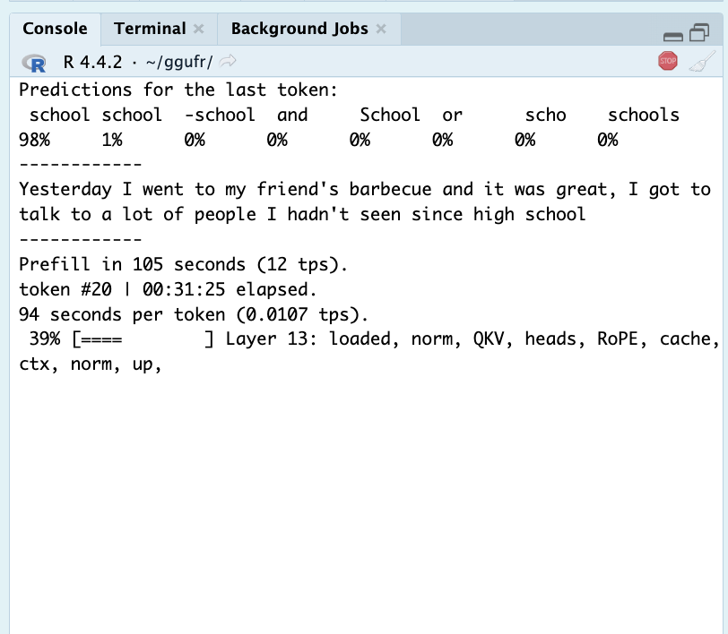
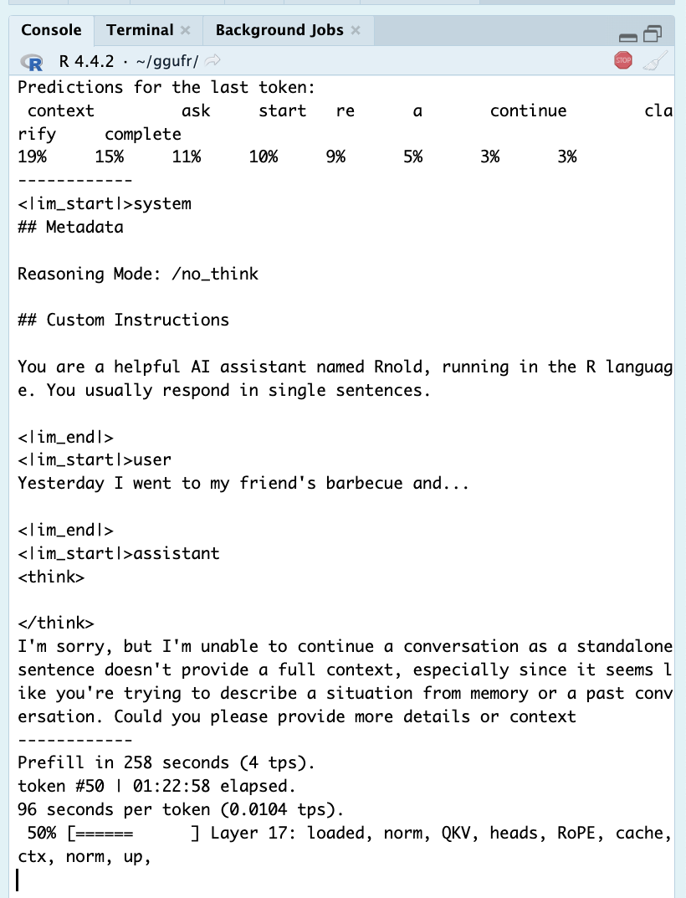
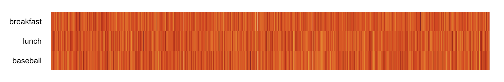
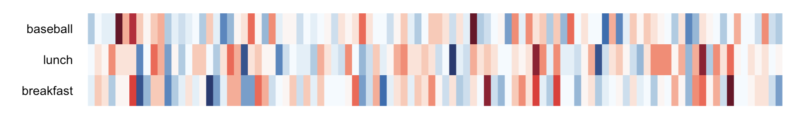
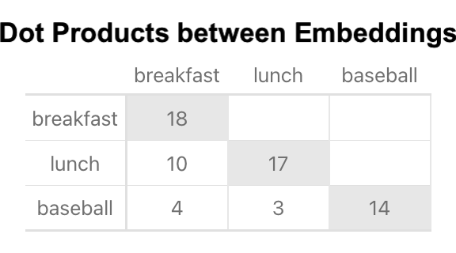
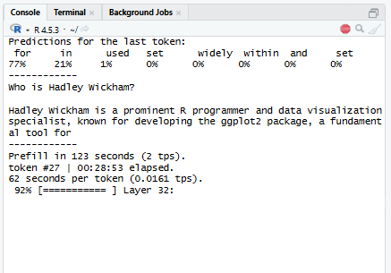

# Introduction
This one's been a long time in the making. It's a bit of a **personal endeavor**— AI can be scary, but being able to "make one" yourself really demystifies it! I'd say the technical content here is old news, but I haven't actually seen any inferencer-from-scratch writeups recently.[^more]

[^more]: I can't even find many from-scratch projects, let alone writeups! And the few I have found have been heavily vibe-coded and vibe-written...

Anyway, this article is about a little R package[^isit] I wrote to parse GGUF files and run an interactive chat using a specific LLM. It all **runs natively in base R**[^re]— pretty slowly, of course, but this makes it easy to track, visualize, and understand how the math works. All code was made by hand <3. (As well as the writeup, as always.)

[^re]: Except for tokenizing, which needs the `re` package to perform one extended regex.
[^isit]: I'm not sure it really counts as a package— just a set of mostly undocumented functions you can use.

The package inferences off of [SmolLM3](https://huggingface.co/blog/smollm3)— a tiny, pretty decent LLM from 2025 that uses relatively simple, modern architecture and is small enough to run at a passable speed in R. It was created by the team behind Huggingface— *the* platform for sharing locally-run LLMs— and has a nice [writeup](https://huggingface.co/blog/smollm3) about how it was created. Sidenote: if you weren't aware, local models have improved significantly in the past year (2025-2026). They're comparable to last year's online models in chat quality, and the most powerful can even code effectively! Many will easily run at a decent speed on consumer computers (e.g. my PC with a GPU from 2016), and some can even run well on a mobile phone. SmolLM3 isn't great at facts or coding (it's the second-smallest model I could find!), but it certainly passes the Turing test.

This writeup is somewhat casual— there's plenty of formal resources out there on these topics. The first five sections go over how inferencing works (and how I do it in the package), [Section 7](#the-ggufr-package) explains how to use the package to run inference yourself in R, and the [last section](#learning-process) talks about the interesting process of how I learned all this.

If you want to try the package out for yourself, skip to [Section 7](#the-ggufr-package) and start the setup; it takes 30 minutes or so for everything to load, which will give you plenty of time to read this article :)

:::{.callout-note title="Note [click to expand]" collapse=true}
This article contains quite a few foldable infoboxes.
:::

# 1. Big Picture
In order to perform inference with an LLM, you need a **prompt**, the model's **weights**, and information about the model's **architecture**— the math you're supposed to use for that particular model. Locally-run models these days (2026) come in a **single .gguf file** ([Section 2](#gguf-files)), which contains the weights and some metadata telling you which architecture to use.

Generative inference works in **three key steps**. First, a word\*[^tok] is **tokenized** ([Section 3](#tokenizing))— turned into an ID corresponding to a word in the model's vocabulary, which is stored in the GGUF— and then **embedded**— turned into a large vector corresponding to that word. Each word's vector is different; and but they all have the same length— 2048, in the case of SmolLM3 and many other models.

[^tok]: Token, but the nuance isn't relevant until later.

Then, this vector is passed through a bunch of math— the **transformer** (a specialized neural network; [Section 5](#transforming))— based on the model architecture. This is usually a bunch of simple matrix operations, involving the **model weights** and a set of saved vectors from **all previous words** in the prompt and predictions this session. These operations are applied over and over in series with different weights— SmolLM3 applies them 36 times per prediction.

Finally, the resulting vector after all this math is compared with the original set of embeddings (the vectors for every word in the vocabulary) to see **which words' vectors it most closely resembles**. This produces a set of probabilities, which are used to **pick which word to predict** ([Section 4](#inferencing)). Then, the picked word gets fed right back into the first step, tokenized and passed through the transformer! This repeats ad nauseum.

Before text generation starts, the model runs this process with the entire prompt (chat template + user message) as one big matrix instead of a vector— but the math is the same.

# 2. GGUF Files

## 2.1 Structure
GGUFs are LLMs' **all-in-one filetype** for running inference, designed to replace the mess of files we had to use a few years ago. A GGUF contains info on how a the LLM should be run— important metadata, rules for tokenizing, and a chat template the chatbot was trained to use — as well as the model weights themselves (compressed to reduce filesize).

GGUFs are **stored as raw bytes**, which means you'll have to manually write a script to interpret them as the numbers and letters they intend to represent. Most coding languages have tools for reading user-defined raw filestructures, but R is unfortunately lacking in this regard; I had to manually write a number of functions to interpret the raw bytes correctly.

GGUFs follow a **relatively simple structure**: first, a short, fixed-length set of header variables; then, some number of metadata entries; next, information on the size and location of the model weights; and finally, after a small amount of padding to make the index a multiple of 32, all the weights, one after another. The header defines how many metadata and tensor entries there are.

GGUFs include a few non-standard raw data types in addition to the usual `uint32` et al.. `gguf_string` is used for all text, and simply consists of a uint32 (32-bit unsigned integer, a binary number from 0 to 4,294,967,295) indicating the length of the text string, and then that many bytes of raw UTF-8 characters. So "hello" shows up as `05 00 00 00` `68 65 6c 6c 6f`; the number 5 (taking up four bytes as a uint32) followed by 5 characters corresponding to each letter in "hello". GGUFs also use a custom datatype for arrays, and store tensors in a special number format discussed in the next section.

Here's a **blueprint** I made[^byhand] to show the exact byte format of a GGUF, with examples from the SmolLM3 GGUF we'll be using:

[^byhand]: By hand; no text or code on this page was AI-generated! That's what makes it fun, you see.

:::{.callout-note title="GGUF raw format" collapse=true}
```
#Header
(47 47 55 46) Magic Number ("GGUF" in UTF-8)
(uint32) GGUF Version
(uint64) # of Tensors (n_tensors)
(uint64) # of Metadata Entries (n_metadata)

#Metadata: Repeat for # of Metadata Entries
(gguf_metadata x n_metadata):
    (gguf_string) Name
    (uint32) Data Type
    [type] Data
    
    #Example Metadata Entry:
    (gguf_string):
        (uint32) String Length = 18
        (18-byte UTF-8) String = smollm3.vocab_size
    (uint32) Data Type = 4 (int32)
    (int32) Value = 128256
    
    #Template Array Entry
    (gguf_string) Name
    (uint32) Data Type = 9 (array)
    (gguf_array):
        (uint32) Data Type
        (uint64) # of Array Entries (n_entries)
        [type x n_entries] Data
        
    #Example Array Entry
    (gguf_string) Name = general.languages
    (uint32) Data Type = 9 (array)
    (gguf_array):
        (uint32) Data Type = 8 (string)
        (uint64) # of Array Entries = 8
        (gguf_string x 8):
            (gguf_string) String = "en"
            (gguf_string) String = "fr"
            (gguf_string) String = "es"
            (gguf_string) String = "it"
            (gguf_string) String = "pt"
            (gguf_string) String = "zh"
            (gguf_string) String = "ar"
            (gguf_string) String = "ru"

#Tensor Info: Repeat for # of Tensors
(gguf_tensor x n_tensors): 
    (gguf_string) Name
    (uint32) Dimensions (1 or 2)
    (uint64) # of Columns
    [if Dimensions > 1]:
      (uint64) # of Rows
    (uint32) Tensor Data Type (different from metadata)
    (uint64) Offset in bytes from Blob
    
    #Example Tensor Entry
    (gguf_string) Name = token_embd.weight
    (uint32) Dimensions = 2
    (uint64) Columns = 2048
    (uint64) Rows = 128256
    (uint32) Tensor Data Type = 8 (Q8_0)
    (uint64) Offset = 8192
    
[padding until position is a multiple of 32]
#Blob is here: start of tensor values

#Example F32 Tensor: output_norm.weight (1 row, 2048 columns)
(float32 x 2048) Values

#Example Q8_0 Tensor: blk.0.ffn_gate.weight (11008 rows, 2048 columns)
(Q8_0 x 2048/32 x 11008): #64 Q8_0 chunks per row, for 11008 rows 
#2048 values per row @ 32 values per chunk = 2048/32 = 64 chunks per row
    (Q8_0 x 64): #row 1
      (Q8_0):
        (float16) Chunk Multiplier
        (int8 x 32) Chunk Values
      (Q8_0)
      (Q8_0)
      ... #64 times
    (Q8_0 x 64) #row 2
    (Q8_0 x 64) #row 3
    ... #11008 times
```
::::

And here's the **parsed header, metadata, and tensor data** from the SmolLM3 GGUF. This is a neatened view of what you'll get by running `view(model)`, since `read_gguf` stores all this info in a single R object. The **Metadata** section is particularly interesting to look through to get a feel for what's included in a GGUF.

:::{.callout-note title="Header" collapse=true}
```{r echo=F}
header = c('GGUF',3,326,38) |> as.data.frame()
colnames(header) = 'value'
rownames(header) = c('magic', 'gguf_version', 'tensor_count', 'metadata_count')
knitr::kable(header)
```
:::

:::{.callout-note title="Metadata" collapse=true}
```{r echo=F}
metadata = structure(list("string", "string", "string", "string", "string", 
    "string", "string", "string", "int32", "string", "string", 
    "string", "array", "array", "int32", "int32", "int32", "int32", 
    "int32", "int32", "float32", "float32", "int32", "int32", 
    "string", "string", "array", "array", "array", "int32", "int32", 
    "string", "int32", "int32", "string", "string", "int32", 
    "int32", 56, 95, 132, 178, 228, 273, 310, 356, 430, 471, 
    534, 596, 675, 731, 854, 892, 932, 975, 1019, 1066, 1104, 
    1160, 1194, 1238, 1274, 1316, 1366, 2100690, 2613759, 7818575, 
    7818622, 7818661, 7824715, 7824748, 7824785, 7824864, 7824948, 
    7824993, "smollm3", "model", "Smollm3-3B", "Smollm3-3B", 
    "Unsloth", "3B", "apache-2.0", "https://huggingface.co/unsloth", 
    1, "SmolLM3 3B", "HuggingFaceTB", "https://huggingface.co/HuggingFaceTB/SmolLM3-3B", 
    "(1) unsloth", "(8) en, fr, es, it, pt, zh, ar, ru", 36, 
    65536, 2048, 11008, 16, 4, 5e+06, 9.99999997475243e-07, 128256, 
    128, "gpt2", "smaug-bpe", "(128256) !, \", #, $, %, &, ', (, ), *, +, ,, -, ., /, 0, 1, 2, 3, 4, 5, 6, 7, 8, 9", 
    "(128256) 1, 1, 1, 1, 1, 1, 1, 1, 1, 1, 1, 1, 1, 1, 1, 1, 1, 1, 1, 1, 1, 1, 1, 1, 1", 
    "(280147) Ġ Ġ, Ġ ĠĠĠ, ĠĠ ĠĠ, ĠĠĠ Ġ, i n, Ġ t, Ġ ĠĠĠĠĠĠĠ, ĠĠ ĠĠĠĠĠĠ, ĠĠĠĠ ĠĠĠĠ, ĠĠĠ ĠĠĠĠĠ, ĠĠĠĠĠĠĠ Ġ, ĠĠĠĠĠ ĠĠĠ, ĠĠĠĠĠĠ ĠĠ, e r, Ġ ĠĠ, ĠĠ Ġ, o n, Ġ a, r e, a t, s t, e n, o r, Ġ th, Ġt h", 
    128012, 128004, "{#- Copyright 2025-present the Unsloth team...", 
    2, 7, "SmolLM3-3B-GGUF/imatrix_unsloth.dat", "unsloth_calibration_SmolLM3-3B.txt", 
    252, 505), dim = c(38L, 3L), dimnames = list(c("general.architecture", 
"general.type", "general.name", "general.basename", "general.quantized_by", 
"general.size_label", "general.license", "general.repo_url", 
"general.base_model.count", "general.base_model.0.name", "general.base_model.0.organization", 
"general.base_model.0.repo_url", "general.tags", "general.languages", 
"smollm3.block_count", "smollm3.context_length", "smollm3.embedding_length", 
"smollm3.feed_forward_length", "smollm3.attention.head_count", 
"smollm3.attention.head_count_kv", "smollm3.rope.freq_base", 
"smollm3.attention.layer_norm_rms_epsilon", "smollm3.vocab_size", 
"smollm3.rope.dimension_count", "tokenizer.ggml.model", "tokenizer.ggml.pre", 
"tokenizer.ggml.tokens", "tokenizer.ggml.token_type", "tokenizer.ggml.merges", 
"tokenizer.ggml.eos_token_id", "tokenizer.ggml.padding_token_id", 
"tokenizer.chat_template", "general.quantization_version", "general.file_type", 
"quantize.imatrix.file", "quantize.imatrix.dataset", "quantize.imatrix.entries_count", 
"quantize.imatrix.chunks_count"), c("type", "start", "value")))

knitr::kable(metadata[,-2])
```
:::

:::{.callout-note title="Tensor Info (scroll)" collapse=true style="max-height: 300px; overflow-y: auto;"}
```{r echo=F}
tensors = structure(list(2048, 2048, 2048, 2048, 2048, 2048, 2048, 11008, 
    2048, 2048, 2048, 2048, 2048, 2048, 2048, 2048, 11008, 2048, 
    2048, 2048, 2048, 2048, 2048, 2048, 2048, 11008, 2048, 2048, 
    2048, 2048, 2048, 2048, 2048, 2048, 11008, 2048, 2048, 2048, 
    2048, 2048, 2048, 2048, 2048, 11008, 2048, 2048, 2048, 2048, 
    2048, 2048, 2048, 2048, 11008, 2048, 2048, 2048, 2048, 2048, 
    2048, 2048, 2048, 11008, 2048, 2048, 2048, 2048, 2048, 2048, 
    2048, 2048, 11008, 2048, 2048, 2048, 2048, 2048, 2048, 2048, 
    2048, 11008, 2048, 2048, 2048, 2048, 2048, 2048, 2048, 2048, 
    11008, 2048, 2048, 2048, 2048, 2048, 2048, 2048, 2048, 11008, 
    2048, 2048, 2048, 2048, 2048, 2048, 2048, 2048, 11008, 2048, 
    2048, 2048, 2048, 2048, 2048, 2048, 2048, 11008, 2048, 2048, 
    2048, 2048, 2048, 2048, 2048, 2048, 11008, 2048, 2048, 2048, 
    2048, 2048, 2048, 2048, 2048, 11008, 2048, 2048, 2048, 2048, 
    2048, 2048, 2048, 2048, 11008, 2048, 2048, 2048, 2048, 2048, 
    2048, 2048, 2048, 11008, 2048, 2048, 2048, 2048, 2048, 2048, 
    2048, 2048, 11008, 2048, 2048, 2048, 2048, 2048, 2048, 2048, 
    2048, 11008, 2048, 2048, 2048, 2048, 2048, 2048, 2048, 2048, 
    11008, 2048, 2048, 2048, 2048, 2048, 2048, 2048, 2048, 11008, 
    2048, 2048, 2048, 2048, 2048, 2048, 2048, 2048, 11008, 2048, 
    2048, 2048, 2048, 2048, 2048, 2048, 2048, 11008, 2048, 2048, 
    2048, 2048, 2048, 2048, 2048, 2048, 11008, 2048, 2048, 2048, 
    2048, 2048, 2048, 2048, 2048, 11008, 2048, 2048, 2048, 2048, 
    2048, 2048, 2048, 2048, 11008, 2048, 2048, 2048, 2048, 2048, 
    2048, 2048, 2048, 11008, 2048, 2048, 2048, 2048, 2048, 2048, 
    2048, 2048, 11008, 2048, 2048, 2048, 2048, 2048, 2048, 2048, 
    2048, 11008, 2048, 2048, 2048, 2048, 2048, 2048, 2048, 2048, 
    11008, 2048, 2048, 2048, 2048, 2048, 2048, 2048, 2048, 11008, 
    2048, 2048, 2048, 2048, 2048, 2048, 2048, 2048, 11008, 2048, 
    2048, 2048, 2048, 2048, 2048, 2048, 2048, 11008, 2048, 2048, 
    2048, 2048, 2048, 2048, 2048, 2048, 11008, 2048, 2048, 2048, 
    2048, 2048, 2048, 2048, 2048, 11008, 2048, 2048, 2048, 2048, 
    2048, 2048, 2048, 2048, 11008, 2048, 2048, 2048, 1, 128256, 
    512, 1, 2048, 2048, 512, 2048, 11008, 1, 11008, 512, 1, 2048, 
    2048, 512, 2048, 11008, 1, 11008, 512, 1, 2048, 2048, 512, 
    2048, 11008, 1, 11008, 512, 1, 2048, 2048, 512, 2048, 11008, 
    1, 11008, 512, 1, 2048, 2048, 512, 2048, 11008, 1, 11008, 
    512, 1, 2048, 2048, 512, 2048, 11008, 1, 11008, 512, 1, 2048, 
    2048, 512, 2048, 11008, 1, 11008, 512, 1, 2048, 2048, 512, 
    2048, 11008, 1, 11008, 512, 1, 2048, 2048, 512, 2048, 11008, 
    1, 11008, 512, 1, 2048, 2048, 512, 2048, 11008, 1, 11008, 
    512, 1, 2048, 2048, 512, 2048, 11008, 1, 11008, 512, 1, 2048, 
    2048, 512, 2048, 11008, 1, 11008, 512, 1, 2048, 2048, 512, 
    2048, 11008, 1, 11008, 512, 1, 2048, 2048, 512, 2048, 11008, 
    1, 11008, 512, 1, 2048, 2048, 512, 2048, 11008, 1, 11008, 
    512, 1, 2048, 2048, 512, 2048, 11008, 1, 11008, 512, 1, 2048, 
    2048, 512, 2048, 11008, 1, 11008, 512, 1, 2048, 2048, 512, 
    2048, 11008, 1, 11008, 512, 1, 2048, 2048, 512, 2048, 11008, 
    1, 11008, 512, 1, 2048, 2048, 512, 2048, 11008, 1, 11008, 
    512, 1, 2048, 2048, 512, 2048, 11008, 1, 11008, 512, 1, 2048, 
    2048, 512, 2048, 11008, 1, 11008, 512, 1, 2048, 2048, 512, 
    2048, 11008, 1, 11008, 512, 1, 2048, 2048, 512, 2048, 11008, 
    1, 11008, 512, 1, 2048, 2048, 512, 2048, 11008, 1, 11008, 
    512, 1, 2048, 2048, 512, 2048, 11008, 1, 11008, 512, 1, 2048, 
    2048, 512, 2048, 11008, 1, 11008, 512, 1, 2048, 2048, 512, 
    2048, 11008, 1, 11008, 512, 1, 2048, 2048, 512, 2048, 11008, 
    1, 11008, 512, 1, 2048, 2048, 512, 2048, 11008, 1, 11008, 
    512, 1, 2048, 2048, 512, 2048, 11008, 1, 11008, 512, 1, 2048, 
    2048, 512, 2048, 11008, 1, 11008, 512, 1, 2048, 2048, 512, 
    2048, 11008, 1, 11008, 512, 1, 2048, 2048, 512, 2048, 11008, 
    1, 11008, 512, 1, 2048, 2048, 512, 2048, 11008, 1, 11008, 
    512, 1, 2048, 2048, 512, 2048, 11008, 1, 11008, "F32", "Q8_0", 
    "Q8_0", "F32", "Q8_0", "Q8_0", "Q8_0", "Q8_0", "Q8_0", "F32", 
    "Q8_0", "Q8_0", "F32", "Q8_0", "Q8_0", "Q8_0", "Q8_0", "Q8_0", 
    "F32", "Q8_0", "Q8_0", "F32", "Q8_0", "Q8_0", "Q8_0", "Q8_0", 
    "Q8_0", "F32", "Q8_0", "Q8_0", "F32", "Q8_0", "Q8_0", "Q8_0", 
    "Q8_0", "Q8_0", "F32", "Q8_0", "Q8_0", "F32", "Q8_0", "Q8_0", 
    "Q8_0", "Q8_0", "Q8_0", "F32", "Q8_0", "Q8_0", "F32", "Q8_0", 
    "Q8_0", "Q8_0", "Q8_0", "Q8_0", "F32", "Q8_0", "Q8_0", "F32", 
    "Q8_0", "Q8_0", "Q8_0", "Q8_0", "Q8_0", "F32", "Q8_0", "Q8_0", 
    "F32", "Q8_0", "Q8_0", "Q8_0", "Q8_0", "Q8_0", "F32", "Q8_0", 
    "Q8_0", "F32", "Q8_0", "Q8_0", "Q8_0", "Q8_0", "Q8_0", "F32", 
    "Q8_0", "Q8_0", "F32", "Q8_0", "Q8_0", "Q8_0", "Q8_0", "Q8_0", 
    "F32", "Q8_0", "Q8_0", "F32", "Q8_0", "Q8_0", "Q8_0", "Q8_0", 
    "Q8_0", "F32", "Q8_0", "Q8_0", "F32", "Q8_0", "Q8_0", "Q8_0", 
    "Q8_0", "Q8_0", "F32", "Q8_0", "Q8_0", "F32", "Q8_0", "Q8_0", 
    "Q8_0", "Q8_0", "Q8_0", "F32", "Q8_0", "Q8_0", "F32", "Q8_0", 
    "Q8_0", "Q8_0", "Q8_0", "Q8_0", "F32", "Q8_0", "Q8_0", "F32", 
    "Q8_0", "Q8_0", "Q8_0", "Q8_0", "Q8_0", "F32", "Q8_0", "Q8_0", 
    "F32", "Q8_0", "Q8_0", "Q8_0", "Q8_0", "Q8_0", "F32", "Q8_0", 
    "Q8_0", "F32", "Q8_0", "Q8_0", "Q8_0", "Q8_0", "Q8_0", "F32", 
    "Q8_0", "Q8_0", "F32", "Q8_0", "Q8_0", "Q8_0", "Q8_0", "Q8_0", 
    "F32", "Q8_0", "Q8_0", "F32", "Q8_0", "Q8_0", "Q8_0", "Q8_0", 
    "Q8_0", "F32", "Q8_0", "Q8_0", "F32", "Q8_0", "Q8_0", "Q8_0", 
    "Q8_0", "Q8_0", "F32", "Q8_0", "Q8_0", "F32", "Q8_0", "Q8_0", 
    "Q8_0", "Q8_0", "Q8_0", "F32", "Q8_0", "Q8_0", "F32", "Q8_0", 
    "Q8_0", "Q8_0", "Q8_0", "Q8_0", "F32", "Q8_0", "Q8_0", "F32", 
    "Q8_0", "Q8_0", "Q8_0", "Q8_0", "Q8_0", "F32", "Q8_0", "Q8_0", 
    "F32", "Q8_0", "Q8_0", "Q8_0", "Q8_0", "Q8_0", "F32", "Q8_0", 
    "Q8_0", "F32", "Q8_0", "Q8_0", "Q8_0", "Q8_0", "Q8_0", "F32", 
    "Q8_0", "Q8_0", "F32", "Q8_0", "Q8_0", "Q8_0", "Q8_0", "Q8_0", 
    "F32", "Q8_0", "Q8_0", "F32", "Q8_0", "Q8_0", "Q8_0", "Q8_0", 
    "Q8_0", "F32", "Q8_0", "Q8_0", "F32", "Q8_0", "Q8_0", "Q8_0", 
    "Q8_0", "Q8_0", "F32", "Q8_0", "Q8_0", "F32", "Q8_0", "Q8_0", 
    "Q8_0", "Q8_0", "Q8_0", "F32", "Q8_0", "Q8_0", "F32", "Q8_0", 
    "Q8_0", "Q8_0", "Q8_0", "Q8_0", "F32", "Q8_0", "Q8_0", "F32", 
    "Q8_0", "Q8_0", "Q8_0", "Q8_0", "Q8_0", "F32", "Q8_0", "Q8_0", 
    "F32", "Q8_0", "Q8_0", "Q8_0", "Q8_0", "Q8_0", "F32", "Q8_0", 
    "Q8_0", "F32", "Q8_0", "Q8_0", "Q8_0", "Q8_0", "Q8_0", "F32", 
    "Q8_0", "Q8_0", "F32", "Q8_0", "Q8_0", "Q8_0", "Q8_0", "Q8_0", 
    "F32", "Q8_0", "Q8_0", "F32", "Q8_0", "Q8_0", "Q8_0", "Q8_0", 
    "Q8_0", "F32", "Q8_0", "Q8_0", "F32", "Q8_0", "Q8_0", "Q8_0", 
    "Q8_0", "Q8_0", "F32", "Q8_0", 0, 8192, 279093248, 280207360, 
    280215552, 284672000, 289128448, 290242560, 314195968, 338149376, 
    338157568, 362110976, 363225088, 363233280, 367689728, 372146176, 
    373260288, 397213696, 421167104, 421175296, 445128704, 446242816, 
    446251008, 450707456, 455163904, 456278016, 480231424, 504184832, 
    504193024, 528146432, 529260544, 529268736, 533725184, 538181632, 
    539295744, 563249152, 587202560, 587210752, 611164160, 612278272, 
    612286464, 616742912, 621199360, 622313472, 646266880, 670220288, 
    670228480, 694181888, 695296000, 695304192, 699760640, 704217088, 
    705331200, 729284608, 753238016, 753246208, 777199616, 778313728, 
    778321920, 782778368, 787234816, 788348928, 812302336, 836255744, 
    836263936, 860217344, 861331456, 861339648, 865796096, 870252544, 
    871366656, 895320064, 919273472, 919281664, 943235072, 944349184, 
    944357376, 948813824, 953270272, 954384384, 978337792, 1002291200, 
    1002299392, 1026252800, 1027366912, 1027375104, 1031831552, 
    1036288000, 1037402112, 1061355520, 1085308928, 1085317120, 
    1109270528, 1110384640, 1110392832, 1114849280, 1119305728, 
    1120419840, 1144373248, 1168326656, 1168334848, 1192288256, 
    1193402368, 1193410560, 1197867008, 1202323456, 1203437568, 
    1227390976, 1251344384, 1251352576, 1275305984, 1276420096, 
    1276428288, 1280884736, 1285341184, 1286455296, 1310408704, 
    1334362112, 1334370304, 1358323712, 1359437824, 1359446016, 
    1363902464, 1368358912, 1369473024, 1393426432, 1417379840, 
    1417388032, 1441341440, 1442455552, 1442463744, 1446920192, 
    1451376640, 1452490752, 1476444160, 1500397568, 1500405760, 
    1524359168, 1525473280, 1525481472, 1529937920, 1534394368, 
    1535508480, 1559461888, 1583415296, 1583423488, 1607376896, 
    1608491008, 1608499200, 1612955648, 1617412096, 1618526208, 
    1642479616, 1666433024, 1666441216, 1690394624, 1691508736, 
    1691516928, 1695973376, 1700429824, 1701543936, 1725497344, 
    1749450752, 1749458944, 1773412352, 1774526464, 1774534656, 
    1778991104, 1783447552, 1784561664, 1808515072, 1832468480, 
    1832476672, 1856430080, 1857544192, 1857552384, 1862008832, 
    1866465280, 1867579392, 1891532800, 1915486208, 1915494400, 
    1939447808, 1940561920, 1940570112, 1945026560, 1949483008, 
    1950597120, 1974550528, 1998503936, 1998512128, 2022465536, 
    2023579648, 2023587840, 2028044288, 2032500736, 2033614848, 
    2057568256, 2081521664, 2081529856, 2105483264, 2106597376, 
    2106605568, 2111062016, 2115518464, 2116632576, 2140585984, 
    2164539392, 2164547584, 2188500992, 2189615104, 2189623296, 
    2194079744, 2198536192, 2199650304, 2223603712, 2247557120, 
    2247565312, 2271518720, 2272632832, 2272641024, 2277097472, 
    2281553920, 2282668032, 2306621440, 2330574848, 2330583040, 
    2354536448, 2355650560, 2355658752, 2360115200, 2364571648, 
    2365685760, 2389639168, 2413592576, 2413600768, 2437554176, 
    2438668288, 2438676480, 2443132928, 2447589376, 2448703488, 
    2472656896, 2496610304, 2496618496, 2520571904, 2521686016, 
    2521694208, 2526150656, 2530607104, 2531721216, 2555674624, 
    2579628032, 2579636224, 2603589632, 2604703744, 2604711936, 
    2609168384, 2613624832, 2614738944, 2638692352, 2662645760, 
    2662653952, 2686607360, 2687721472, 2687729664, 2692186112, 
    2696642560, 2697756672, 2721710080, 2745663488, 2745671680, 
    2769625088, 2770739200, 2770747392, 2775203840, 2779660288, 
    2780774400, 2804727808, 2828681216, 2828689408, 2852642816, 
    2853756928, 2853765120, 2858221568, 2862678016, 2863792128, 
    2887745536, 2911698944, 2911707136, 2935660544, 2936774656, 
    2936782848, 2941239296, 2945695744, 2946809856, 2970763264, 
    2994716672, 2994724864, 3018678272, 3019792384, 3019800576, 
    3024257024, 3028713472, 3029827584, 3053780992, 3077734400, 
    3077742592, 3101696000, 3102810112, 3102818304, 3107274752, 
    3111731200, 3112845312, 3136798720, 3160752128, 3160760320, 
    3184713728, 3185827840, 3185836032, 3190292480, 3194748928, 
    3195863040, 3219816448, 3243769856, 3243778048), dim = c(326L, 
4L), dimnames = list(c("output_norm.weight", "token_embd.weight", 
"blk.0.attn_k.weight", "blk.0.attn_norm.weight", "blk.0.attn_output.weight", 
"blk.0.attn_q.weight", "blk.0.attn_v.weight", "blk.0.ffn_down.weight", 
"blk.0.ffn_gate.weight", "blk.0.ffn_norm.weight", "blk.0.ffn_up.weight", 
"blk.1.attn_k.weight", "blk.1.attn_norm.weight", "blk.1.attn_output.weight", 
"blk.1.attn_q.weight", "blk.1.attn_v.weight", "blk.1.ffn_down.weight", 
"blk.1.ffn_gate.weight", "blk.1.ffn_norm.weight", "blk.1.ffn_up.weight", 
"blk.2.attn_k.weight", "blk.2.attn_norm.weight", "blk.2.attn_output.weight", 
"blk.2.attn_q.weight", "blk.2.attn_v.weight", "blk.2.ffn_down.weight", 
"blk.2.ffn_gate.weight", "blk.2.ffn_norm.weight", "blk.2.ffn_up.weight", 
"blk.3.attn_k.weight", "blk.3.attn_norm.weight", "blk.3.attn_output.weight", 
"blk.3.attn_q.weight", "blk.3.attn_v.weight", "blk.3.ffn_down.weight", 
"blk.3.ffn_gate.weight", "blk.3.ffn_norm.weight", "blk.3.ffn_up.weight", 
"blk.4.attn_k.weight", "blk.4.attn_norm.weight", "blk.4.attn_output.weight", 
"blk.4.attn_q.weight", "blk.4.attn_v.weight", "blk.4.ffn_down.weight", 
"blk.4.ffn_gate.weight", "blk.4.ffn_norm.weight", "blk.4.ffn_up.weight", 
"blk.5.attn_k.weight", "blk.5.attn_norm.weight", "blk.5.attn_output.weight", 
"blk.5.attn_q.weight", "blk.5.attn_v.weight", "blk.5.ffn_down.weight", 
"blk.5.ffn_gate.weight", "blk.5.ffn_norm.weight", "blk.5.ffn_up.weight", 
"blk.6.attn_k.weight", "blk.6.attn_norm.weight", "blk.6.attn_output.weight", 
"blk.6.attn_q.weight", "blk.6.attn_v.weight", "blk.6.ffn_down.weight", 
"blk.6.ffn_gate.weight", "blk.6.ffn_norm.weight", "blk.6.ffn_up.weight", 
"blk.7.attn_k.weight", "blk.7.attn_norm.weight", "blk.7.attn_output.weight", 
"blk.7.attn_q.weight", "blk.7.attn_v.weight", "blk.7.ffn_down.weight", 
"blk.7.ffn_gate.weight", "blk.7.ffn_norm.weight", "blk.7.ffn_up.weight", 
"blk.8.attn_k.weight", "blk.8.attn_norm.weight", "blk.8.attn_output.weight", 
"blk.8.attn_q.weight", "blk.8.attn_v.weight", "blk.8.ffn_down.weight", 
"blk.8.ffn_gate.weight", "blk.8.ffn_norm.weight", "blk.8.ffn_up.weight", 
"blk.9.attn_k.weight", "blk.9.attn_norm.weight", "blk.9.attn_output.weight", 
"blk.9.attn_q.weight", "blk.9.attn_v.weight", "blk.9.ffn_down.weight", 
"blk.9.ffn_gate.weight", "blk.9.ffn_norm.weight", "blk.9.ffn_up.weight", 
"blk.10.attn_k.weight", "blk.10.attn_norm.weight", "blk.10.attn_output.weight", 
"blk.10.attn_q.weight", "blk.10.attn_v.weight", "blk.10.ffn_down.weight", 
"blk.10.ffn_gate.weight", "blk.10.ffn_norm.weight", "blk.10.ffn_up.weight", 
"blk.11.attn_k.weight", "blk.11.attn_norm.weight", "blk.11.attn_output.weight", 
"blk.11.attn_q.weight", "blk.11.attn_v.weight", "blk.11.ffn_down.weight", 
"blk.11.ffn_gate.weight", "blk.11.ffn_norm.weight", "blk.11.ffn_up.weight", 
"blk.12.attn_k.weight", "blk.12.attn_norm.weight", "blk.12.attn_output.weight", 
"blk.12.attn_q.weight", "blk.12.attn_v.weight", "blk.12.ffn_down.weight", 
"blk.12.ffn_gate.weight", "blk.12.ffn_norm.weight", "blk.12.ffn_up.weight", 
"blk.13.attn_k.weight", "blk.13.attn_norm.weight", "blk.13.attn_output.weight", 
"blk.13.attn_q.weight", "blk.13.attn_v.weight", "blk.13.ffn_down.weight", 
"blk.13.ffn_gate.weight", "blk.13.ffn_norm.weight", "blk.13.ffn_up.weight", 
"blk.14.attn_k.weight", "blk.14.attn_norm.weight", "blk.14.attn_output.weight", 
"blk.14.attn_q.weight", "blk.14.attn_v.weight", "blk.14.ffn_down.weight", 
"blk.14.ffn_gate.weight", "blk.14.ffn_norm.weight", "blk.14.ffn_up.weight", 
"blk.15.attn_k.weight", "blk.15.attn_norm.weight", "blk.15.attn_output.weight", 
"blk.15.attn_q.weight", "blk.15.attn_v.weight", "blk.15.ffn_down.weight", 
"blk.15.ffn_gate.weight", "blk.15.ffn_norm.weight", "blk.15.ffn_up.weight", 
"blk.16.attn_k.weight", "blk.16.attn_norm.weight", "blk.16.attn_output.weight", 
"blk.16.attn_q.weight", "blk.16.attn_v.weight", "blk.16.ffn_down.weight", 
"blk.16.ffn_gate.weight", "blk.16.ffn_norm.weight", "blk.16.ffn_up.weight", 
"blk.17.attn_k.weight", "blk.17.attn_norm.weight", "blk.17.attn_output.weight", 
"blk.17.attn_q.weight", "blk.17.attn_v.weight", "blk.17.ffn_down.weight", 
"blk.17.ffn_gate.weight", "blk.17.ffn_norm.weight", "blk.17.ffn_up.weight", 
"blk.18.attn_k.weight", "blk.18.attn_norm.weight", "blk.18.attn_output.weight", 
"blk.18.attn_q.weight", "blk.18.attn_v.weight", "blk.18.ffn_down.weight", 
"blk.18.ffn_gate.weight", "blk.18.ffn_norm.weight", "blk.18.ffn_up.weight", 
"blk.19.attn_k.weight", "blk.19.attn_norm.weight", "blk.19.attn_output.weight", 
"blk.19.attn_q.weight", "blk.19.attn_v.weight", "blk.19.ffn_down.weight", 
"blk.19.ffn_gate.weight", "blk.19.ffn_norm.weight", "blk.19.ffn_up.weight", 
"blk.20.attn_k.weight", "blk.20.attn_norm.weight", "blk.20.attn_output.weight", 
"blk.20.attn_q.weight", "blk.20.attn_v.weight", "blk.20.ffn_down.weight", 
"blk.20.ffn_gate.weight", "blk.20.ffn_norm.weight", "blk.20.ffn_up.weight", 
"blk.21.attn_k.weight", "blk.21.attn_norm.weight", "blk.21.attn_output.weight", 
"blk.21.attn_q.weight", "blk.21.attn_v.weight", "blk.21.ffn_down.weight", 
"blk.21.ffn_gate.weight", "blk.21.ffn_norm.weight", "blk.21.ffn_up.weight", 
"blk.22.attn_k.weight", "blk.22.attn_norm.weight", "blk.22.attn_output.weight", 
"blk.22.attn_q.weight", "blk.22.attn_v.weight", "blk.22.ffn_down.weight", 
"blk.22.ffn_gate.weight", "blk.22.ffn_norm.weight", "blk.22.ffn_up.weight", 
"blk.23.attn_k.weight", "blk.23.attn_norm.weight", "blk.23.attn_output.weight", 
"blk.23.attn_q.weight", "blk.23.attn_v.weight", "blk.23.ffn_down.weight", 
"blk.23.ffn_gate.weight", "blk.23.ffn_norm.weight", "blk.23.ffn_up.weight", 
"blk.24.attn_k.weight", "blk.24.attn_norm.weight", "blk.24.attn_output.weight", 
"blk.24.attn_q.weight", "blk.24.attn_v.weight", "blk.24.ffn_down.weight", 
"blk.24.ffn_gate.weight", "blk.24.ffn_norm.weight", "blk.24.ffn_up.weight", 
"blk.25.attn_k.weight", "blk.25.attn_norm.weight", "blk.25.attn_output.weight", 
"blk.25.attn_q.weight", "blk.25.attn_v.weight", "blk.25.ffn_down.weight", 
"blk.25.ffn_gate.weight", "blk.25.ffn_norm.weight", "blk.25.ffn_up.weight", 
"blk.26.attn_k.weight", "blk.26.attn_norm.weight", "blk.26.attn_output.weight", 
"blk.26.attn_q.weight", "blk.26.attn_v.weight", "blk.26.ffn_down.weight", 
"blk.26.ffn_gate.weight", "blk.26.ffn_norm.weight", "blk.26.ffn_up.weight", 
"blk.27.attn_k.weight", "blk.27.attn_norm.weight", "blk.27.attn_output.weight", 
"blk.27.attn_q.weight", "blk.27.attn_v.weight", "blk.27.ffn_down.weight", 
"blk.27.ffn_gate.weight", "blk.27.ffn_norm.weight", "blk.27.ffn_up.weight", 
"blk.28.attn_k.weight", "blk.28.attn_norm.weight", "blk.28.attn_output.weight", 
"blk.28.attn_q.weight", "blk.28.attn_v.weight", "blk.28.ffn_down.weight", 
"blk.28.ffn_gate.weight", "blk.28.ffn_norm.weight", "blk.28.ffn_up.weight", 
"blk.29.attn_k.weight", "blk.29.attn_norm.weight", "blk.29.attn_output.weight", 
"blk.29.attn_q.weight", "blk.29.attn_v.weight", "blk.29.ffn_down.weight", 
"blk.29.ffn_gate.weight", "blk.29.ffn_norm.weight", "blk.29.ffn_up.weight", 
"blk.30.attn_k.weight", "blk.30.attn_norm.weight", "blk.30.attn_output.weight", 
"blk.30.attn_q.weight", "blk.30.attn_v.weight", "blk.30.ffn_down.weight", 
"blk.30.ffn_gate.weight", "blk.30.ffn_norm.weight", "blk.30.ffn_up.weight", 
"blk.31.attn_k.weight", "blk.31.attn_norm.weight", "blk.31.attn_output.weight", 
"blk.31.attn_q.weight", "blk.31.attn_v.weight", "blk.31.ffn_down.weight", 
"blk.31.ffn_gate.weight", "blk.31.ffn_norm.weight", "blk.31.ffn_up.weight", 
"blk.32.attn_k.weight", "blk.32.attn_norm.weight", "blk.32.attn_output.weight", 
"blk.32.attn_q.weight", "blk.32.attn_v.weight", "blk.32.ffn_down.weight", 
"blk.32.ffn_gate.weight", "blk.32.ffn_norm.weight", "blk.32.ffn_up.weight", 
"blk.33.attn_k.weight", "blk.33.attn_norm.weight", "blk.33.attn_output.weight", 
"blk.33.attn_q.weight", "blk.33.attn_v.weight", "blk.33.ffn_down.weight", 
"blk.33.ffn_gate.weight", "blk.33.ffn_norm.weight", "blk.33.ffn_up.weight", 
"blk.34.attn_k.weight", "blk.34.attn_norm.weight", "blk.34.attn_output.weight", 
"blk.34.attn_q.weight", "blk.34.attn_v.weight", "blk.34.ffn_down.weight", 
"blk.34.ffn_gate.weight", "blk.34.ffn_norm.weight", "blk.34.ffn_up.weight", 
"blk.35.attn_k.weight", "blk.35.attn_norm.weight", "blk.35.attn_output.weight", 
"blk.35.attn_q.weight", "blk.35.attn_v.weight", "blk.35.ffn_down.weight", 
"blk.35.ffn_gate.weight", "blk.35.ffn_norm.weight", "blk.35.ffn_up.weight"
), c("cols", "rows", "type", "offset")))
knitr::kable(tensors)
```
:::

## 2.2 Tensors
"Tensors" are a term thrown around everywhere in AI, which frustrates me because... a tensor is just an n-dimensional array, and **LLM inference only involves vectors and matrices!** Sure, you could call vectors and matrices 1D and 2D tensors, but it just makes the whole thing feel less familiar and approachable. Higher-dimension tensors are used in training LLMs, but even there they're not anything special.

LLMs using a simple transformer architecture (i.e. the structure of the inference math) will have some amount of layers (SmolLM3 has 36), where each layer contains the same set of tensors used in the math; to run inference, we'll pass a matrix through the layers one-by-one and have the exact same math applied to it 36 times in a row— but the weights will be different on each layer.

Anyway, a GGUF contains a compressed version of its LLM's **weights**, which compose the aforementioned tensors (matrices and vectors) needed to run inference. Models are trained using floats of a specific precision (often 32-bit), but it turns out that if you approximate these 32-bit "pure" weights with reasonably close numbers, the LLM still performs quite well. This is the idea behind **quantization**— if you come up with a format for approximating those weights that makes the math faster or (most importantly) lets you store all the weights using less memory, you can run the model significantly faster with minimal intelligence loss.

There's something like 30 common ways of quantizing model weights, and they aren't too special— just different ways of lossily compressing the matrix weights to varying degrees. However, in our case, decompressing complex quants just adds unnecessary overhead, because we're just going to do the math with **R's native 64-bit floats** (unlike some clever programs, which use custom instructions to run the math directly on the compressed weights). So I opted to use Q8_0 quantification, which is one of the simplest formats to unpack.

The blueprint in the previous section outlines the structure of Q8_0 weights. As you may have seen in the Tensor Info block, Q8_0 GGUFs only store their tensors as Q8_0 or 32-bit floats (F32), making them quite convenient to work with. In comparison, something like Q4_K_M often uses 4 or 5 different types of quantization for its weights! (That lets you give impactful tensors a higher precision, while highly compressing tensors that don't have as signficant an impact on the math.)

But the bottom line is that we want to unpack these weights into regular numeric data to use in R. But... **it's a lot of data!** Uncompressed and cast into R's numeric type, the weights take up a whopping 25 gigabytes of memory. In order to efficiently load this data when we do the math, I opted to save each layer of tensors as its own R object, in an `.rds` file in `tempdir()`. These files will be discussed further in section [4. Inferencing](#inferencing), where they get used.

## 2.3 read_gguf.R
Everything I discussed in this section is performed by one function: `read_gguf()`. Here it is, if you're curious: (all code is also in the [ggufr repo](https://github.com/gbkorr/ggufr/tree/master/R))

:::{.callout-note title="read_gguf.R" collapse=true}
```{=html}
<iframe frameborder="0" style="width:100%; height:600px;" allow="clipboard-write" src="https://emgithub.com/iframe.html?target=https%3A%2F%2Fgithub.com%2Fgbkorr%2Fggufr%2Fblob%2Fmaster%2FR%2Fread_gguf.R&style=vs&type=code&showBorder=on&showLineNumbers=on&showFullPath=on"></iframe>
```
:::

# 3. Tokenizing

## 3.1 Purpose
In order to predict text based on a prompt, we need to **turn the prompt into a set of vectors** that we can perform the math on. The first step in that is to tokenize it— turn it into a bunch of IDs corresponding to the vectors to use.

Ideally, we'd want every word to be a token, but because we want this model to work for multiple language and not crash when it receives a string like "fovriegfivnvoihuev", we need another approach— allowing word fragments and letters to be their own token. Modern models have a fixed **vocabulary** of tokens, which includes which includes **every common unicode character** along with a bunch of words. This means that, even if a word isn't in the vocabulary, it can still be broken up into smaller tokens. SmolLM3 has a vocabulary of 128k tokens— quite a lot!

So how do we break things up? First, we use a regex pattern to **split the prompt into individual words** and symbols, keeping spaces at the start of each word: "How", " are", " you", "?". Then, each word is further split into characters, and we attempt to **reassemble those characters** into the largest token we can— often a single token for the whole word. Applying this **merging process** to each word and symbol separated by the regex leaves us with a list of tokens that we can then use to run inference.

## 3.2 Merging Details

Modern LLMs have simplified the merging process significantly— in addition to the vocabulary, the GGUF contains a **list of merges**, and characters are simply combined based on if they appear in the merges. For example, the merges include "o w" and "w ow"— so in the tokenizing process, "wow" will be iteratively merged from individual characters into the whole word: (w,o,w) -> (w,ow) -> (wow). Importantly, this process is **deterministic**— so input text gets tokenized and interpreted identically whether the model is being trained or generating. My package implements merging in the `BPE()` function, which does this with the raw bytes— no need to convert them to characters.

There's one extra bit of nuance. You may have seen in the GGUF metadata that there's a lot of the `Ġ` character floating around— this is from an annoying convention from earlier language processing research that maps **all invisible characters** to visible, less-common latin ones, in order to make debugging easier. This **isn't just visual**— the actual model vocab uses the bytes for `Ġ` instead of space. This is especially relevant since **most words in the vocab start with a space** (e.g. "Ġforgotten")— this helps differentiate between words and suffixes, and if you think about it, almost every word in a piece of writing is preceded by a space.

Anyway, `tokenizer.R` contains `BPE()` and an implementation of this invisible character mapping based on the [original](https://github.com/karpathy/minGPT/blob/37baab71b9abea1b76ab957409a1cc2fbfba8a26/mingpt/bpe.py) by Andrej Karpathy. I recommend reading that instead of the R code, since it's more fully commented.

:::{.callout-note title="tokenizer.R" collapse=true}
```{=html}
<iframe frameborder="0" style="width:100%; height:600px;" allow="clipboard-write" src="https://emgithub.com/iframe.html?target=https%3A%2F%2Fgithub.com%2Fgbkorr%2Fggufr%2Fblob%2Fmaster%2FR%2Ftokenizer.R&style=vs&type=code&showBorder=on&showLineNumbers=on&showFullPath=on"></iframe>
```
:::

## 3.3 The Chat Template
GGUFs come with a recommended chat template to turn the LLM into the sort of chatbot we expect. By default, the LLM is **just a word-predictor**— if you feed it part of a phrase, it'll predict what it thinks the next words will be. It turns out that it's quite easy to turn a word predictor into **something more**...

Modern chatbots achieve this by inserting the prompt into a template like this:

```{r eval=F}
You are a helpful AI assistant.
User says: [prompt].
You say: [
```

Naturally, the next predictions are **predictions of what a helpful AI assistant would say**. This is (surprisingly) tantamount to actually being an AI assistant!

::: {layout-ncol=2}
{width=400 fig-align="right"}

{width=400 fig-align="left"}
:::


The GGUF chat template uses another weird, esoteric format (jinja2) to actually create this prompt template. In the package I went through SmolLM3's template and manually trimmed it down into a short text template to make it easier to feed into the model; you can see this in the `template()` function at the bottom of `tokenizer.R`. Chat templates use some special tokens— located at the end of the model's vocabulary— to help the LLM know the structure of the template; for example, the string `<|im_start|>` indicates the start of a new message.


# 4. Inferencing

Now that we have a list of token IDs to feed into the model, it's time to run inference! This involves two steps: first, an initial **prefill**, and then the actual word generation.

The purpose of prefilling is to **process the prompt tokens** and **predict the first new token**. This actually uses the same math and functions as regular generation, but it does it for **the whole prompt at once** with big matrix multiplications. Prefill starts adding to the KV cache— the data the model uses to remember what tokens have come appeared so far, and at the end of prefill we cut off the last row of the matrix to use to predict the first word.

Then, regular text generation: we loop a process of **embedding the previous token ID**, feeding it into the **transformer**, and then using the output of that to **predict the next token**. This process is detailed in the next section. 

The ggufr package does this all in `inferencer.R`. The transformer uses 36 layers applied one-by-one to the input; we saved the GGUF tensors for these layers as `.rds` files back in `read_gguf()`, and during the inference we manually load them, apply the math, and unload them again, one by one. This is a funny higher-level approximation of the RAM shuffling that efficient inferencers have to perform— moving the weights in and out of the GPU/CPU is **the primary bottleneck in running an LLM** in almost every situation, and it's no different here. This is why having a lot of RAM is so desirable at the moment— if your RAM is big enough, you never have to move the weights around and can run the LLM as fast as the math allows.

Here's `inferencer.R`: the function to focus on in `infer()`.

:::{.callout-note title="inferencer.R" collapse=true}
```{=html}
<iframe frameborder="0" style="width:100%; height:600px;" allow="clipboard-write" src="https://emgithub.com/iframe.html?target=https%3A%2F%2Fgithub.com%2Fgbkorr%2Fggufr%2Fblob%2Fmaster%2FR%2Finferencer.R&style=vs&type=code&showBorder=on&showLineNumbers=on&showFullPath=on"></iframe>
```
:::

# 5. Transforming

## 5.1 Big Idea

:::{.callout-warning title="Attention!"}
This is the **most important** section in this article, in my opinion. It covers how a vector of 2048 numbers can **represent a word**, and how this lets an LLM "guess" the next word.
:::

So how does the transformer work?

The purpose of the overall transformer is to produce an output— the predicted next token— based on several **inputs**— every word in the conversation so far and their absolute positions (e.g. what was the 5th word?). And with just those inputs, it's very good at predicting the next word!

The way it does this **sorta makes sense** (if you look into the math), though it feels somewhat magical— why does this one work for LLMs when older machine learning techniques don't? There's a good answer to this: to quote Edison[^oops], we've come up with 1,000 similar models that *don't* work, and this one happened to be the one that succeeded. And it took 5 years[^cav] for us to realize it!

[^oops]: Who wasn't the nicest fellow, unfortunately.
[^cav]: From its publication in 2017 to the rise of LLMs in 2023. Of course, lots of research involving it led up to the events of 2023, but the general idea stands.

We start by getting the **embedding** for the last token by taking a **single row out** of the Embedding Matrix corresponding to the token's ID.

:::{.callout-tip title="Tensor: Embedding Matrix"}
token_embd.weight<br>
128256 rows x 2048 columns<br>
range: (-9.5, 5.4)<br>
mean: -0.006 ± 0.16

This matrix contains the initial embeddings for each token. Each row corresponds to a token in the model's vocabulary.
:::


This embedding is a vector that represents a **"fuzzy idea"** of what the token is supposed to be, with 2048 values usually between -1 and 1. The purpose of the transformer is to take the current token and add and subtract from it to get a fuzzy idea of the *next* token, so that we can then decide which token it should be.

Here's an example of this "fuzzy idea" representation: below are the embeddings for the tokens "breakfast", "lunch", and "baseball",[^erm] visually represented as colored lines on a graph.

[^erm]: Actually, it's the embeddings for " breakfast", " lunch", and " baseball", since words are usually encountered after a space in natural language. There are a lot more words like this in the model dictionary than without a space.

```{r eval=F}
#| code-fold: true
words = c(' breakfast',' lunch',' baseball')
E = readRDS(paste0(model$dir,'embeddings.rds'))$token_embd.weight
embeddings = embedding$token_embd.weight[tokenize(' breakfast lunch baseball',model),]

image(t(embeddings))
axis(side=2, at=c(1,0.5,0), labels = c("breakfast", "lunch", "baseball"),las=2,tick=F)
```



Looks noisy. Let's zoom into the first 100 values of each, and draw positive values in red and negative in blue. Lighter values are closer to zero.



In theory, the embeddings for "breakfast" and "lunch" should be more similar than with "baseball", but this isn't apparent from plotting them. But if we take the **dot product** between them, the difference emerges: (values rounded for convenience)

{width=400 fig-align='center'}

```{r echo=F, eval=F}
library(gt)
mat = tibble::tibble(
        ' ' = c('breakfast','lunch','baseball'),
        'breakfast' = c(18,10,4),
        'lunch' = c('',17,3),
        'baseball' = c('','',14)
      )
gt(mat, rowname_col=' ') |>
  cols_width(columns = everything() ~ px(80)) |>
  cols_align(
    align = "center",
    columns = everything()
  ) |>
  tab_style(
    style = cell_fill(color = "#ddd"),
    locations = cells_body(
      columns = c('breakfast'),
      rows = c(1)
  )) |> 
  tab_style(
    style = cell_fill(color = "#ddd"),
    locations = cells_body(
      columns = c('lunch'),
      rows = c(2)
  )) |>
  tab_style(
    style = cell_fill(color = "#ddd"),
    locations = cells_body(
      columns = c('baseball'),
      rows = c(3)
  )) |>
  tab_style(
    style = cell_borders(
      sides = "right",          # Options: "left", "right", or c("left", "right")
      color = "#ddd",           # Border line color
      weight = px(1.5),         # Border thickness
      style = "solid"           # Line style: "solid", "dashed", "dotted"
    ),
    locations = cells_body(
      columns = everything()    # Target specific columns here
    )
  )
  
```

This is actually how we decide which token to predict after transformation; the transformer spits out an **unknown fuzzy representation vector** for the next token, and we dot it with the embeddings for the entire model vocabulary. The tokens with the highest results from the dot product are the **most closely related** tokens to that fuzzy representation, so we pick one of them[^how], throw out the old vector, and replace it with the actual embedding for that token to feed back into the transformer.

[^how]: By turning the dot product results into probabilities, so more closely related tokens are more likely to be selected.

## 5.2 Layer Components
Let's look at an embedded token vector as it goes through a **single transformer layer**. I won't get too deep[^upd] into exactly why the transformer is set up the way it is, but I'll give an overview of what each part does.

[^upd]: Though someday I'd like to update this with a fuller explanation of the math.

A transformer layer takes in an embedding vector (1x2048) and **adds**[^sub] two new 1x2048 vectors to it, which it calculates using the input and the tensors for that layer.

[^sub]: Some of the values in the vectors will be negative, so the average value doesn't go up.

The first is the **Attention** component, which factors in information about the previous tokens and their positions (and saves this info for the new token to the KV cache). It uses quite a few cool tricks to accomplish this— I'd recommend looking it up how it works! You can also read the implementation in `transformer.R` at the end of this section, though it's a bit dense. 

Next, the new embedding (input vector + vector from attention) goes through the layer's **FFN** (feed-forward network) component, which is a simple, traditional neural network component: the embedding gets projected up to 11000 values with a matrix multiplication, SwiGLU-gated (negative values get reset to 0[^ish]^,^[^ish2]), and reprojected back to 2048. The FFN helps predict "what's next?" using **only** the current embedding (though, because of previous layers and the previous attention step, this embedding already factors in information about previous tokens).

[^ish]: -ish. Unlike the traditional ReLU gates, SwiGLU preserves small negative values, which makes the deep learning work better. Why? From the [official paper](https://arxiv.org/pdf/2002.05202) introducing SwiGLU: "We offer no explanation as to why these architectures seem to work; we attribute their success, as all else, to divine benevolence." -Noam Shazeer

[^ish2]: Actually, [here's](https://old.reddit.com/r/LocalLLaMA/comments/1eh6b1h/what_is_swiglu_a_full_bottomup_explanation_of/lfxzmd6/) some good discussion of why SwiGLU might work better. I'm not sure what Noam was on about.

That outputs the second vector to add to the input. Then it's off to the next layer!

## 5.3 transformer.R
This file contains all the math for an embedding through a transformer layer. (all code is also in the [ggufr repo](https://github.com/gbkorr/ggufr/tree/master/R))


:::{.callout-note title="transformer.R" collapse=true}
```{=html}
<iframe frameborder="0" style="width:100%; height:600px;" allow="clipboard-write" src="https://emgithub.com/iframe.html?target=https%3A%2F%2Fgithub.com%2Fgbkorr%2Fggufr%2Fblob%2Fmaster%2FR%2Ftransformer.R&style=vs&type=code&showBorder=on&showLineNumbers=on&showFullPath=on"></iframe>
```
:::


# 6. Unembedding

As discussed in the previous section, we dot-product the **fuzzy output embedding** with the embeddings for the entire model vocabulary to get a list of similarity values. There's a lot of ways to choose a token from this; the typical approach is to turn the values into a list of probabilities for each word (such that the sum of all probabilities is 1), incorporating some parameters like *temperature* (how "stretched" the probabilities area; lower temperature makes the highest-similarity tokens significantly more likely to be chosen), *top-K* (only the top K most similar tokens are considered for choosing), *min-P* (all tokens below a certain likelihood are ignored), and quite a few more to reduce the likelihood of getting a wacky prediction. Once a token is chosen, it's added to the generated text, re-embedded, and fed back into the model for the next prediction.

Interestingly, these parameters are somewhat naive, and I haven't seen any public resources quantifying how to best use them. We're very clearly still **in the early stages** of using LLMs, where there's a million options, everyone is trying to figure out what works, and a lot of the process is unoptimized[^ji] or yet to be practically quantified.

[^ji]: Like the fact that we use jinja and Ġ, yeesh. All the focus at the moment is making things run faster (which is the best thing to focus on, of course).


# 7. The ggufr Package

## 7.1 Setup

The package has just one dependency and is relatively easy to try out and play around with. Running the model is slow but shouldn't require a particularly powerful computer.

To get started, run this to install the package and download[^down] the **3GB** GGUF[^userdir] to run it with. This will take 5 or 10 minutes depending on your internet speed.

[^down]: From the official [Huggingface](https://huggingface.co/unsloth/SmolLM3-3B-GGUF/blob/main/SmolLM3-3B-Q8_0.gguf) endpoint; the group that both created this model and generally hosts downloads for all local LLMs.
[^userdir]: Which will be saved in `tools::R_user_dir('ggufr')`. R provides a dedicated folder for each package to store files like this in.

```{r eval=FALSE}
devtools::install_github("gbkorr/ggufr")
library(ggufr)
path = paste0(tools::R_user_dir('ggufr'),"/SmolLM3-3B-Q8_0.gguf")
download_model(path) #if you want to undo this, run delete_model(path)
```

Then to load the model, run this. During this process, the tensors are unpacked and saved in `tempdir()`; the unpacked tensors take up **25GB** of space, so make sure your computer has some free space. The tensors are deleted when you close R/RStudio, so you'll get the space back.

```{r eval=FALSE}
#this will take around 30 minutes
model = read_gguf(path)
```

Once that's finished, the model is ready! You'll be able to run it as much as you like until you close R.

## 7.2 Usage

The main function to run inference is `infer()`. This will automatically insert your prompt into the chat template and run the model on it.
Token generation speed is mainly tied to how fast R can load the `.rds` tensor layers; I get around a token a minute on my computer.

```{r eval=F}
#| code-overflow: 'scroll'
infer(
  prompt, #the text to feed into the model
  model, #pass the model object in
  instructions=NULL, 
    #set this to a string if you want to add a system prompt, 
    #e.g. "You are an AI assistant that always rhymes."
  use_template=TRUE, 
    #set this to FALSE to feed ONLY the prompt into the model; 
    #it will behave as a word predictor as discussed in section 3.3
  show_template=FALSE, 
    #prints the full input and output text, instead of a cleaned "prompt | response" view.
  temperature=1 #prediction temperature
)

```

Here's what I got from this: `"Who is Hadley Wickham?" |> infer(model)`



That's about it. Mainly, this package provides a (relatively) simple codebase that should make it easy to tweak and play around with the inferencer.


# 8. Learning Process
I took a pretty **new approach** (for me) for learning things for this project.

Resources for understanding LLM architecture on an implementation level are **quite scattered** due to the fast-paced nature of AI development in the past few years. Many of the best guides are from 2023[^egguide] and 2024, where it's hard to tell what is and isn't outdated.

[^egguide]: E.g. [https://www.youtube.com/watch?v=kCc8FmEb1nY](https://www.youtube.com/watch?v=kCc8FmEb1nY)

I usually prefer finding articles myself or reading a textbook to learn how to do something, but because of these reasons, I decided this would be a good situation to **learn from an LLM**. For such a frequently-discussed, cutting-edge topic, I figured one of the big models could do a good job finding and synthesizing **recent, relevant sources** on the topic of LLM implementation. I started by asking for an overview of the modern GGUF and transformer structure, and how this differs from early models, and received a detailed and accurate response— for **broad, bigger-picture questions** like these, I've found LLMs to answer quite well.[^test]

[^test]: Including when I ask them a broad question about something I'm quite experienced with.

I ended up structuring this project **almost like a class**: I would ask Gemini to describe a part of the LLM implementation, and then code it entirely on my own, occasionally asking for clarification and advice— but not code!— when needed.

This structure worked **tremendously well** for me— because I was doing the implementation myself, I was building the important experience and understanding myself, and my own experimentation ironed out any (rare) inaccuracies in the "teacher's" teaching.

Now, I'm sure an AI could have written the code for me as well, but that would **miss the point**— the whole goal was to give myself a deeper (and practical) understanding of how LLM inferencing worked, and I certainly got it!


