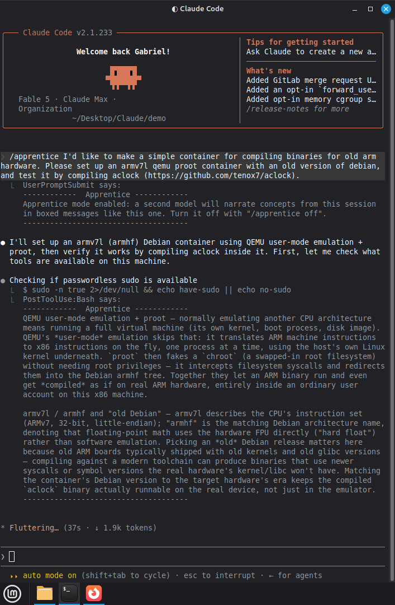
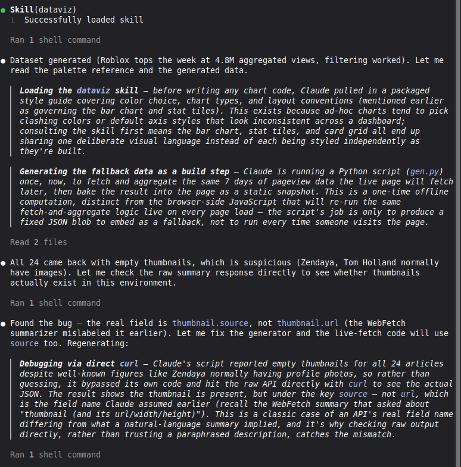
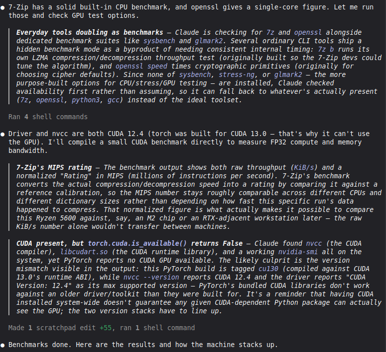

The time finally came for me to properly learn how to use agentic AI. I'd been following local AI excitedly all summer, but it became clear that experience using frontier models would be extremely important for my career.

So I bought a month of Claude[^usage], it rewrote my project in 15 minutes, booted linux on a device I'd failed thrice at, yada yada. You've heard all this before. Anyway, I saw a clear opportunity to improve my experience as a user, made a skill[^plug] to do it, and found it so effective that I though it'd be worth sharing.

[^plug]: technically a plugin
[^usage]: I figured that if I really want good practice, I should use the best model possible (especially since weaker models will likely be just as good within in a year). What I wasn't expecting is for the usage limits to be **incredibly** generous— I think it's something about how I use Claude, but I've never even come close to running out of Fable on the max plan. With that said, give your money to open weights instead :)

I'd like to reiterate that every article[^design] on my blog is written without any AI assistance or editing. Unfortunately, common elements of good prose— like conceptual triplets[^sent], m-dashes[^em], and general eloquence— are also utilized by AI[^ab] and have become associated with them due to the rarity of good writers these days.

[^design]: As well as the website itself, and almost all code featured. The scripts for this plugin are Claude-authored, though.
[^ab]: I've recently abandoned my beloved overuse of **bold text** because it just looks like Claude prose to me now.
[^sent]: Present in this very sentence! Although there's an argument to be made that triplets actually aren't great for prose. My opinion is mixed.
[^em]: Why the heck is the correct term an "em dash"?? I don't call the letter B "bee".

You can get the plugin for yourself at [https://github.com/gbkorr/apprentice](https://github.com/gbkorr/apprentice)

## Manifest

A frontier model like Fable is more than capable of doing nearly all the heavy lifting on a project itself, but this robs users (me) of perhaps the most important reasons to do a project: sure, you end up with something cool, but the real value is in what you learn along the way. Luckily, AI is also more than capable of narrating its decisions and teaching the user what it's doing. Several techniques already exist for facilitating this; this skill adds another that I think fills a useful niche.

I have enough OS experience to roughly follow along with what the agent is doing, but bash calls tend to be hard to parse, and I don't know *everything* about how Linux works. I figured asking for frequent tidbits about the things it's interacting with would give me some useful knowledge and exposure.

## Skill

The concept behind this skill is to de-obfuscate Claude's agentic decisions so that the user can "learn by watching"— if I'm an apprentice apothecary, part of my job is to watch my master as they work to get exposure to the skills I need, and part of their role is to provide tips and info on what and why they're doing. This skill provides that— a subagent listens to the conversation and frequently chimes in with short blurbs about relevant concepts Claude's using, like the purpose of a niche CLI tool it used or the goal of the repo structure it just created.

{width=400}

I was careful with how I did the implementation and prompting (plugin and prompts drafted by Claude, but with significant higher-level guidance, tweaking, and testing— Claude is good at soloing a first draft of things like this, but making a good skill takes hands-on polish). The plugin runs a second agent for the entirety of the conversation (Sonnet, which barely adds additional usage to a Fable session), and it injects info blurbs using the `MessageDisplay` hook visible only to the user. This ensures that it never touches[^prose] the main agent, which is important— the skill **can't influence Claude's actual work**, and **only** exists to give additional context and info to the user. There's a couple reasons for this— mainly, the main agent would forget to write blurbs, but I think maintaining its purity of output is important here too. The skill is designed to be as lightweight as possible; see the [customization](#customization) section later on this page. 

[^prose]: Oh god, I've been reading too many claude logs. I can feel the subtle shifts in my prose that mimic it.

Here's another demo with the current UI: the narrator gives good insight into the agentic work Claude is doing. The left was during a one-shot of the demo prompt `/apprentice Please create a webpage that shows an infographic of the most visited wikipedia articles over the past week.`, and the right from when I asked it to benchmark my computer specs. Again, this skill *doesn't affect the main process*— Claude had no idea these comments were being generated as it worked, which prevents the skill from deteriorating the model's abilities.

::: {layout-ncol=2}
{width=400 fig-align="right"}

{width=400 fig-align="left"}
:::

## Active Learning

```
 ▐▛███▜▌
▝▜█████▛▘
  ▘▘ ▝▝
```

So here's how I use the tool to learn as I watch Claude work instead of sitting back and letting it do my dishes for me. Let me be clear— Claude is still doing my dishes for me, but now it's telling me how it's doing them and I'm asking additional questions so that I'll have enough experience to do the dishes on my own if I have to. 

I already use **/btw** frequently to learn about keywords and concepts I'm unfamiliar with— it's incredibly useful— but this skill sort of adds a new dimension to what I can learn from a session. Getting to read a narration of the actual agentic workflow gives a TON of additional information that I wouldn't have gotten otherwise, unless I did the work myself.

Sometimes it can be a bit hectic to parse through, but I can always... ignore blurbs that don't look interesting. I've decided that the volume of commentary is more benefit than downside, but it's very easy to tweak— just add a line to the narrator prompt (see next section) specifying more or less frequent narration. You can also add topics the blacklist if you're very familiar with them already; I put git/Github integration in my blacklist, for example.


## Customization

As always, my commitment to elegant and minimal solutions and approaches has been a boon when working with AI. This skill is intentionally extremely light, and it's very easy to customize; most notably, you can just edit `skills/apprentice/scripts/narrator-prompt.md` to ask the narrator to say... literally anything based on the conversation, since it has full context.

The goal for this skill was specifically to give me learning and exposure, but I think it could be quite useful if converted into **a full "wtf is claude doing" tool**— based on my experience with the default version, the blurbs will be quite accurate to what and why Claude is running or choosing to do at any given moment, and it would cover a huge gap between obfuscated tool calls and user understanding. You'd just have to tweak narrator-prompt.md for that purpose.

Here's the default `narrator-prompt.md` for reference:

:::{.callout-note collapse=true title="narrator-prompt.md"}
```{=html}
<iframe frameborder="0" scrolling="no" style="width:100%; height:2000px;" allow="clipboard-write" src="https://emgithub.com/iframe.html?target=https%3A%2F%2Fgithub.com%2Fgbkorr%2Fapprentice%2Fblob%2Fmain%2Fskills%2Fapprentice%2Fscripts%2Fnarrator-prompt.md&style=docco&type=code&showBorder=on&showLineNumbers=on&showFileMeta=on&showFullPath=on&showCopy=on"></iframe>
```
:::

## Personal Thoughts

The loss of small-scale coding as a career-defining skill hurts a lot (it's my #1 favorite thing to do, after all), but progress is progress. Having a good understanding of how coding works and how to organize and manage a project, which are the other skills you develop while coding. I just worry it'll be hard to come up with projects if it's always more effective to vibecode them :/

Here's a finishing quote from a goofy daily stoic quotes applet I have on my linux desktop:

> The man who is truly good and wise neither struggles with adversity nor complains of his lot; rather, he takes heart from even the harshest of conditions. -Musonius Rufus, Lecture X

Who knows where AI will take us— but the sun will keep rising. Carpe diem.
