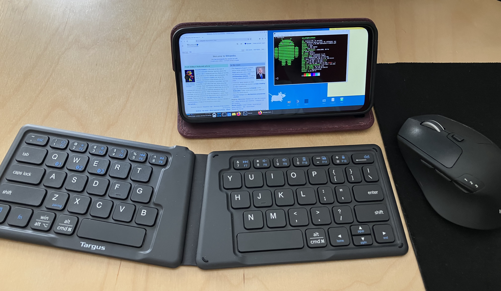
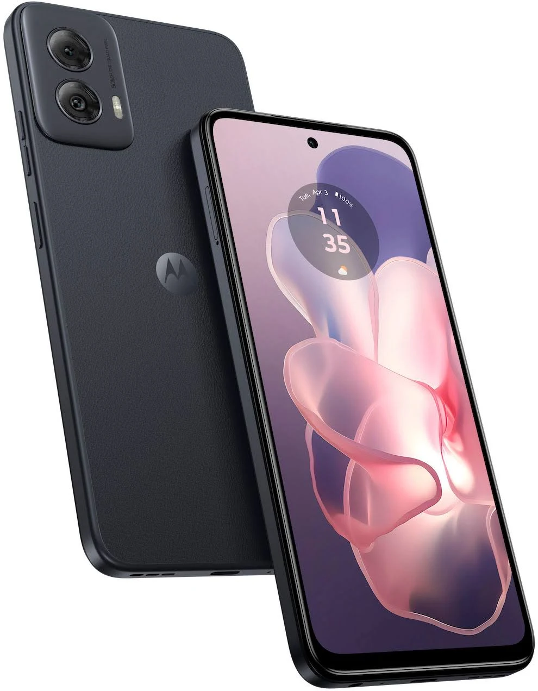
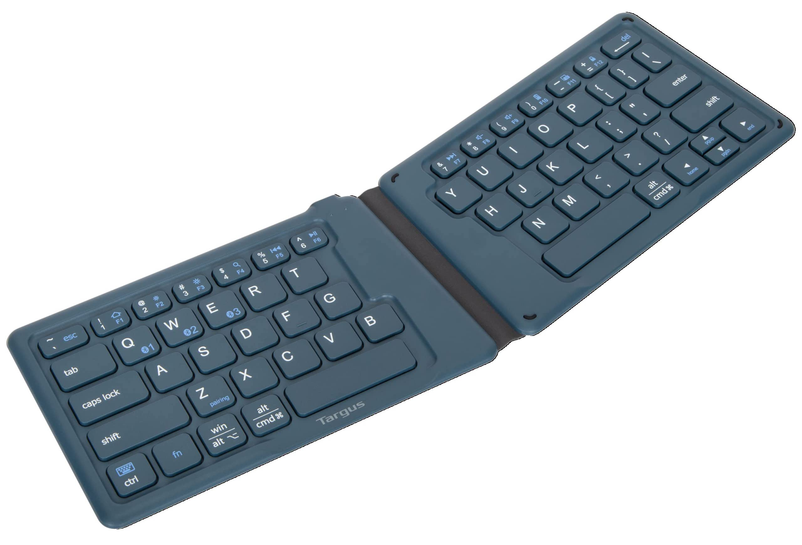
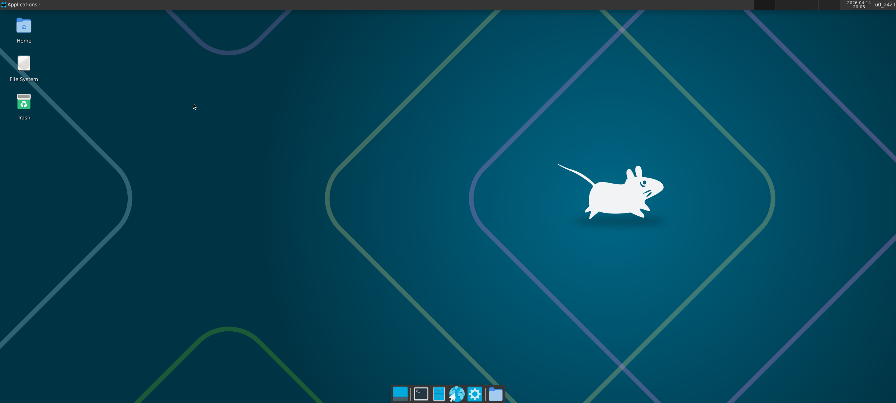
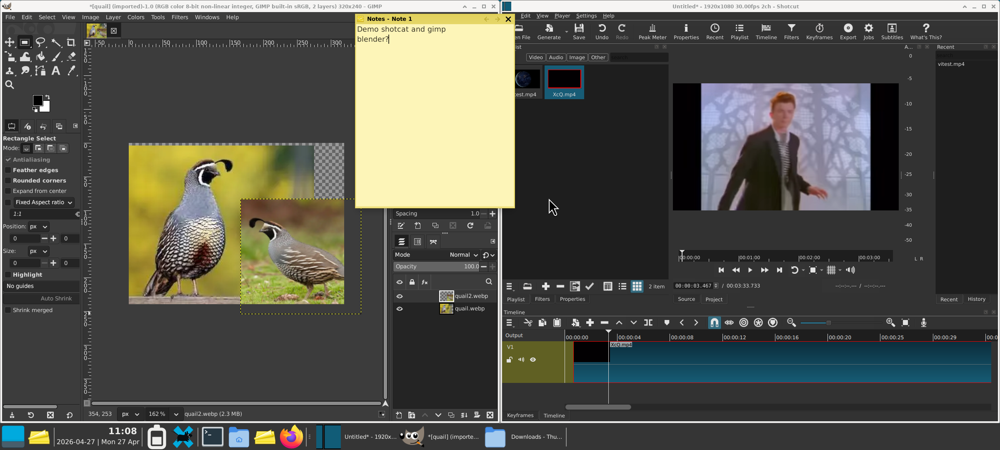
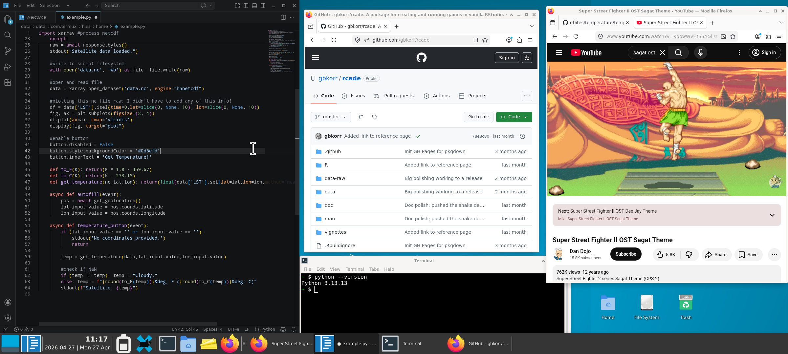
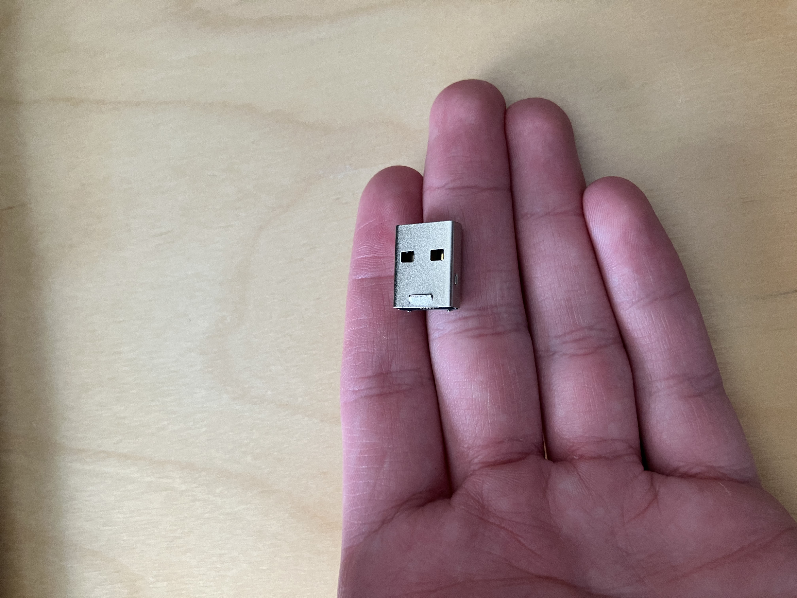
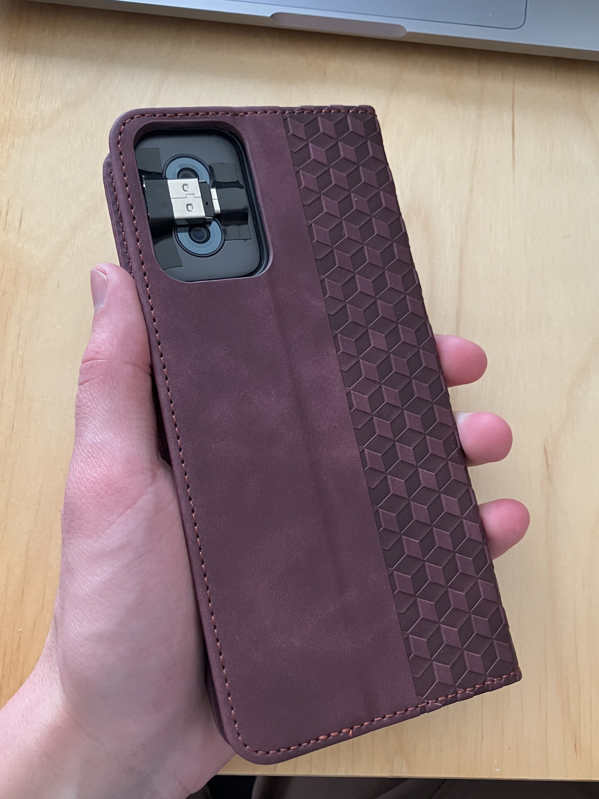
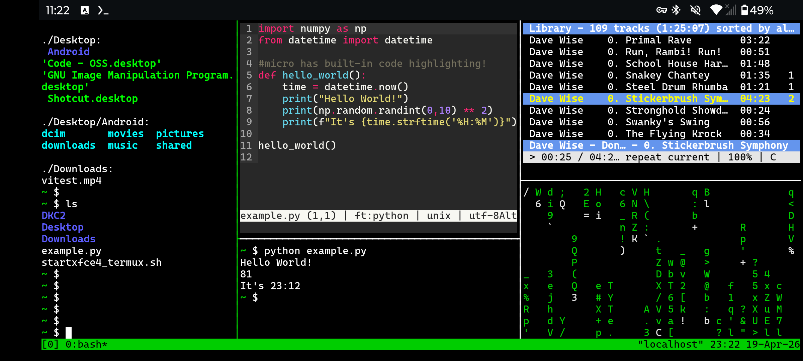
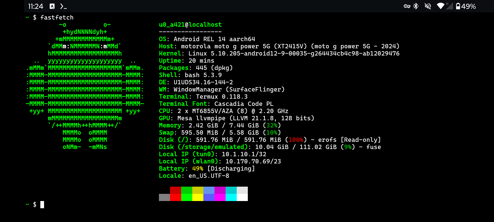

# **1. Introduction**

## 1.1 The Big Idea

{width=800 fig-align="center"}

Phones are pretty powerful in this day and age[^year], supporting pretty good storage and processing power. Both computers and phones are still **relatively expensive**, but...

[^year]: (Mid-2020s)

There's a thing cell providers do now where they sell a phone at **1/4th the market cost** (wow!), but lock the cell service to their specific company (e.g. Verizon)— if you buy the phone and want to use it as a phone, you *must* use that company. The idea is that, because cell service is relatively expensive, someone buying the phone will end up paying more than the cost of the phone to the service provider if they use it for a few years.

But what if we **didn't use it as a phone?** A smartphone with no cell service is still a functioning computer (including WiFi access!), and as I said, its specs are pretty decent now...

It turns out that you can get one of those carrier locked phones new for **under $50**, and turn it into a **decent laptop computer** by running Linux on it! This process doesn't even require rooting/jailbreaking the phone— you could do it to your android today if you wanted.

A word of warning, of course— the process is somewhat involved, and takes some motivation to push through. This is a great example of "you can do things cheaply if you know how and have the patience for it".


## 1.2 The Phone
{height=400 fig-align="center"}

> Note: I may wax eloquent about many of the products I'm using, but I'm not sponsored or affiliated with any of them. I just love a good piece of technology :)

I've opted for a **Moto G Power 2024**[^sad], which is just about **$50** for a new-in-box carrier-locked model. You can (as of writing this) easily find these on Ebay or the likes of Amazon and Walmart.[^mart]

[^sad]: Somehow they decided to *reduce* the computing power of the 2025 version, so I'd recommend the one from 2024.
[^mart]: Carrier-locked phones like these are pretty abundantly available (often selling for below MSRP), because who the heck would want to use one?

With a full HD display, 128 gigs of storage, and 12 gigs of RAM, this phone is **better** than the Macbook Air I used for 10 years— and incredibly cheaper.

### Alternatives
The Moto G Play (especially in upcoming years) has a similar carrier-locked model for just $30, but is a bit weaker and lower-resolution— less suitable for a laptop, but potentially ideal for projects that require a small, versatile computer. This thing costs the same as a Raspberry Pi, but it's more powerful and has an integrated display, battery, and camera! It's actually pretty crazy.

Realistically, any recent Android phone should work; Motorola happens to offer the most powerful phones in this price range at the time of writing.

## 1.3 Limitations
Using a phone as a computer like this comes with **two big limitations**: arm64 architecture and lack of root access.

And of course, you can't use cell service unless you buy the locked provider's plan— but you can connect to your regular phone's hotspot, which dodges the issue entirely! (Or, do this on your main phone if you have an Android)

### Architecture
Phones typically use arm64 chips, as do Raspberry Pis. Generally this makes running things inconvenient occasionally, and forces you to emulate certain executables (especially for video games). Luckily, there's **oodles of emulation options**, and most applications already provide an arm64 executable.

### No Root
The lack of root privileges is actually somewhat nice— it makes it impossible to brick or damage your phone while messing around with the terminal— but it does introduce some issues trying to install and run a lot of libraries and software. Luckily, the software we use for the computer provides an option for a **"pseudo-root" environment**, in which we pretend we have root access and can do almost everything that lets us do. 

This solution isn't perfect—and getting some applications to work is a bit more complicated than on a regular PC—but for the most part, you can **do pretty much do anything** you'd want to do on a personal computer!


# **2. Phone Setup**

## 2.1 First Power-on

The first order of business is to charge the phone enough to power on, and then set it up **without a google account**. You probably could use one, but it'd just cause unnecessary problems.

Then, the most important thing to do once you get to the home screen is to **turn off the wifi**. This prevents the phone from downloading forced system updates; we'll have to disable these permanently (section 2.4) before it's safe to reenable wifi.

## 2.2 Peripherals
{height=400 fig-align="center"}

While the phone/computer is entirely usable as a touch-only device, I'd highly recommend using a **bluetooth keyboard**, and a mouse if you're using it on a desk.[^desk] Android supports these natively and connecting them is quite easy.

[^desk]: The technology for ring-sized touchpads/trackballs is almost here, but cheap versions that work well aren't available yet at the time of writing. Once they are, that's what I'd recommend using— even a tiny touchpad is plenty of space to comfortably (if somewhat slowly) mouse a laptop on the go, and these things take up no space at all in your pocket.

If you want the computer to be portable, there's a good amount of folding keyboards that work quite well. I use and love this **Targus Keyboard**[^keyb] I got on Ebay for $10— its folded dimensions almost *perfectly match* those of the phone! It and the phone fit comfortably together in my pocket.

[^keyb]: A "Targus Ergonomic Foldable Keyboard" or something like that.

Android has a number of hard-coded[^hard] keyboard shortcuts that are quite useful:

[^hard]: I believe Android 16 lets you change these, but I'm using Android 14.

:::{.callout-note title='Shortcuts'}
Home Screen: `Win + Enter` 

Settings: `Win + I`

Search Apps: `Win`

Back: `Win + Backspace`

Show Windows: `Win + Tab`
:::

For completeness, I'm using [this case](https://www.amazon.com/dp/B0D2VNZ6RN)— it's pretty important to get a case that functions as a stand, and I'm quite partial to the magnetic folding leather ones.

## 2.3 Settings

There's a lot of settings to go through. 

:::{.callout-warning title="Developer Settings"}
Settings -> `About phone` -> Tap `Build number` 7 times to enable Developer Mode

Settings -> `System` -> `Developer options`:

- `Disable Automatic System Updates`
- `Enable USB` debugging (easier to transfer files from PC)
- **`Disable child process restrictions`** (important)
:::

:::{.callout-note title="Landscape Settings"}
Settings -> `Display` -> `Auto-rotate screen`

Settings -> `Home & lock screen` -> `Home settings` -> `Allow Home screen rotation`
:::

:::{.callout-note title="Misc Settings"}
Settings -> `Battery` -> `Adaptive Battery` -> **disable `Use Adaptive Battery`** (otherwise this will kill important background processes)

Settings -> `Display` -> `Screen timeout` (I recommend 2 minutes)

Settings -> `Gestures` -> `Press & hold power button` -> `Access power menu`
:::

There's a lot you can do with the Android settings to improve general phone navigation, but it's not worth messing with if the goal is to stay mostly in the Xfce desktop.[^purpose]

[^purpose]: Generally, the phone is better if you like switching between tabs while working, and the Xfce desktop is better if you prefer splitscreen/windows, as I do.

:::{.callout-tip title="Debloating"}
It's usually a good idea to uninstall and disable unnecessary apps when you get a new phone.

Settings -> `Apps` -> `See all apps`:

- Disable anything you won't be using
- Including everything "Google" except for `Files by Google` and `Google Play Services`.
:::

## 2.4 Lock Updates
For our purposes, we *really* want the phone to **stay on the version it came with**. In addition to intentionally slowing down the system, new updates often introduce new bloatware[^bloat], and can generally cause issues with settings and apps we've set up.

[^bloat]: The amount of which seems to increase ever year...

Keeping it on the original version is thankfully quite easy, but only if you know the trick. Several options exist in the settings to turn off automatic updates— *none of them work!* The phone will still try to push system "security" updates to upgrade to the newest version of Android.

### The Trick
How do we prevent the phone from installing new system updates? Just **forbid it from downloading them!** 

To do this, I used [NetGuard](https://github.com/m66b/netguard) to block all internet requests from the updater app. I transferred the app apk from my computer via USB, but you're probably ok flicking the internet on to download it directly from the phone.

:::{.callout-note title="Netguard Setup"}
Settings -> `Options` -> disable `Check for updates`[^why1]

[^why1]: (we don't want NetGuard losing uptime if it updates itself)

Settings -> `Advanced options` -> enable `Manage system apps`

Go back to the main app list in NetGuard

Find `Motorola Software Update` and disable its wifi 

Select the upper-left slider to start the NetGuard firewall
:::

I also disabled internet for Google Play Services, for good measure. NetGuard starts up when the phone boots— the phone will **never system update again** as long as you want it that way. Now we can finally reenable wifi!

### Non-Motorola Options
If you're on a different phone, you may have a different updater you need to suppress. To identify it, follow these steps:

:::{.callout-warning title="App Sleuthing" collapse=true}
1. Close NetGuard.
2. Download and install [PCAPdroid](https://github.com/emanuele-f/PCAPdroid).
3. Open and run PCAPdroid
4. Go to Settings -> `System updates`
5. Turn wifi on via the phone's quick access menu
6. Select `Check for updates`, wait for it to show some sort of loading icon, and quickly disable wifi.
7. Go back to PCAPdroid and view the list of outgoing connections. Look for an app like "Updater", and take note of any other apps you might want to block the internet for.
:::

## 2.5 Google Play Apps
Now that we can access the internet again, it'd be nice to be able to get apps from the Google Play Store. Usually, this requires that you log into a google account, but the [Aurora Store](https://gitlab.com/AuroraOSS/AuroraStore) lets you download them anonymously.

However, it's still a good idea to **download apks directly from GitHub**: many apps on the Google Play Store use an outdated version.


# **3. Linux Setup**

## 3.1 Termux
To run Linux, we'll be using [Termux](https://github.com/termux/termux-app), the terminal emulator for Android. This acts pretty much the same as opening Terminal on Mac or Windows; you get a CLI (command-line interface) that lets you interact with the rest of the device.

You'll need to install 3 app apks, for Termux and two addons:

* **Termux:** [https://github.com/termux/termux-app](https://github.com/termux/termux-app)
* **API:** [https://github.com/termux/termux-api](https://github.com/termux/termux-api)
* **X11:** [https://github.com/termux/termux-x11](https://github.com/termux/termux-x11)

Make sure to download the version that match your phone's architecture; in my case, that's the `arm64` version.

## 3.2 Desktop Setup
{height=300 fig-align="center"}

Once those are installed, it's time to set up the desktop.[^source] This will mostly be running a bunch of code:

[^source]: I learned how to do this [here](https://github.com/LinuxDroidMaster/Termux-Desktops/blob/main/Documentation/native/termux_native.md).

1. Download the required packages:
```bash
pkg update && pkg upgrade
pkg install termux-api x11-repo termux-x11-nightly pulseaudio xfce4
```

2. Create a new file:
```bash
nano ~/startxfce4_termux.sh
```

3. Paste this script[^sorc] and save the file (tap and hold and select paste, then `ctrl+s ctrl+x` to save and exit.)

[^sorc]: [source](https://github.com/LinuxDroidMaster/Termux-Desktops/blob/main/scripts/termux_native/startxfce4_termux.sh)
. Normally I'd just say "copy from this link", but there was a Termux guide once that did this and had a broken link!

:::{.callout-note title="~/startxfce4_termux.sh"}
```bash
#!/data/data/com.termux/files/usr/bin/bash

# Kill open X11 processes
kill -9 $(pgrep -f "termux.x11") 2>/dev/null

# Enable PulseAudio over Network
pulseaudio --start --load="module-native-protocol-tcp auth-ip-acl=127.0.0.1 auth-anonymous=1" --exit-idle-time=-1

# Prepare termux-x11 session
export XDG_RUNTIME_DIR=${TMPDIR}
termux-x11 :0 >/dev/null &

# Wait a bit until termux-x11 gets started.
sleep 3

# Launch Termux X11 main activity
am start --user 0 -n com.termux.x11/com.termux.x11.MainActivity > /dev/null 2>&1
sleep 1

# Set audio server
export PULSE_SERVER=127.0.0.1

# Run XFCE4 Desktop
env DISPLAY=:0 dbus-launch --exit-with-session xfce4-session & > /dev/null 2>&1

exit 0
```
:::


4. And set an alias for it to make it easier to run.

```bash
echo "alias xfce='bash ~/startxfce4_termux.sh'" >> ~/.bashrc && . ~/.bashrc
```

5. Also, it's useful to run this now to get access to the rest of your phone within the desktop:
```bash
termux-setup-storage
```


# **4. Xfce Configuration**

## 4.1 Preferences
Before (or after) starting the desktop, let's change some settings. Click and hold on the app on your phone's home screen, and open `Preferences`.

:::{.callout-note title="Preferences"}
`Output`:

- enable `Fullscreen`
- `Screen orientation` -> `landscape`
- enable `Hide display cutout`

`Keyboard`:

- disable `Show additional keyboard`
- disable `Show IME with external keyboard`
- enable `Enforce char-based input`

`Pointer`:

- `Capture external pointer devices when possible`

You can changes mouse speed here, and mouse acceleration from `Applications` -> `Settings` -> `Mouse and Touchpad` on the Xfce desktop. Note: this is quite sensitive to DPI, and low-DPI mice will feel sluggish. Modern mice typically have good enough DPI, though.
:::

## 4.2 Start Xfce
Now you can go back to Termux and run `xfce` to open the desktop. Your mouse (heh) and keyboard work normally, and it feels just as responsive as a normal computer.

{width=800 fig-align="center"}

## 4.3 Xfce Settings
Time for some housekeeping to make things look a little nicer. Xfce has a lot of tools for customization— go wild![^opts]

Settings can be accessed by right-clicking on the Desktop and navigating `Applications` -> `Settings`.

[^opts]: The default configuration settings are quite powerful, and there are plenty of [addons](https://www.xfce-look.org) you can download to change things more drastically.

### Scroll Zoom
The best thing about Xfce—and something particularly useful because of the small phone screen—is that the entire display can be zoomed in with a hotkey. To set this hotkey, right click on the desktop and go to:

`Applications` -> `Settings` -> `Window Manager Tweaks` -> `Accessibility` -> `Key used to grab and move windows`

I recommend setting this to shift, since some of the other hotkeys are overridden by Android shortcuts.

{width=800 fig-align="center"}
A Gif of the zoom in action. It's much smoother IRL.

### Screensaver

Xfce provides a nice screensaver app, but the performance benefit is questionable. It's likely a better idea to use the phone's regular screen timeout functionality (Settings App -> `Display` -> `Screen timeout`).[^pass]

[^pass]: You'll have to input your password again if the phone turns off, but this can be done entirely from a bluetooth keyboard— just like if you were using a laptop.

If you do want to set up a screensaver, first go to Termux:X11's preferences (see section 4.1) and enable `Output` -> `Keep Screen On`.

Then run `pkg install xfce4-screensaver`; you can now change screensaver settings by right-clicking on the desktop and going to `Applications` -> `Settings` -> `Xfce Screensaver`. You may have to disable `Lock Screen` -> `Lock Screen; I'm not sure if it works otherwise.

## 4.4 Useful Applications

### Terminal
The **Terminal** app just runs Termux in a window, and comes preinstalled with Xfce. Much easier than switching back and forth.

### Firefox
**Firefox** is useful not only as a web browser but also as a fantastic swiss army knife for viewing media formats.

```bash
pkg install firefox
```

To put an application like this on the desktop, right click -> `Create Launcher` and start typing the name of the application. You should then see an option like `Create Launcher Firefox`, which will autofill what you need to create the launcher. 

### Utilities
```bash
pkg install mousepad xfce4-notes-plugin
```
- **Mousepad** is Xfce's basic text editor.
- **Xfce4-notes** is a nice application for sticky notes on the desktop; I recommend adding it to the menu bar.

I've had trouble setting up the basic image/video viewers that exist for Xfce; I'd recommend just using firefox to view media. 

## 4.5 Heavy Editing Software 
You can run some pretty powerful programs here.

* **Image Editing**: [GIMP](https://www.gimp.org/) (`pkg install gimp`)

* **Video Editing**: [Shotcut](https://www.shotcut.org/) (`pkg install shotcut`)

* **Coding IDE**: [code-oss](https://github.com/microsoft/vscode) (`pkg install code-oss`)

(If any of these take too long to download, try running `termux-change-repo` and selecting your nearest continent.)

In my experience, these run at a very reasonable speed! 

{width=800 fig-align="center"}
{width=800 fig-align="center"}

Xfce has automatic tiling— just move a window to the edge of the screen.


## 4.6 Access to Local Files
If you ran `termux-setup-storage` earlier, there should be a folder `~/storage` which links to all the phone's regular files, like Photos and Downloads. You can drag this onto your desktop from the file manager to make it easier to access.

Note that this folder only allows you to access the phone's files within Termux/Xfce, and not the other way around. I've yet to find a way to achieve the opposite. This also applies to access to USB flashdrives. 

Since connecting via USB to another computer gives access to the regular phone filesystem, I usually use the `storage` folder to move any Xfce files over so I can access them on another computer.

### Flashdrive Shenanigans

Need more storage? Instead of buying an expensive microsd card to put in the sim tray, I'm using this \$5 **128gb flashdrive**[^legit] (casing removed) with a \$1 USB-C adapter. 

[^legit]: Yes, I tested it and confirmed it's legit. Soon these will be easier to find at this price, too.

I think you could fit 6 (for >800GB total incl. the phone's internal storage) of these in this little window area if you really wanted to, and it would keep the same small profile. That's some serious manual external storage... 

By including the USB-C adapter, it means I also have a **portable adapter** whenever I need it to connect a regular USB to the phone. (Which is much more useful than the extra storage, )

{width=200 fig-align="center"}{width=200 fig-align="center"}


# **5. Fun with Termux**

There's a lot you can do with Termux, whether or not you're in Xfce.

## 5.1 Termux Settings

If you want to use the Termux app itself (instead of interacting with it via the Terminal application in Xfce), you may want to change some settings to make it more convenient.

:::{.callout-note title="Termux Settings"}
To remove the buttons at the bottom (ESC, HOME, etc.), run:
```bash
echo "extra-keys=[]" >> ~/.termux/termux.properties && exit
```
And reopen the app.

Now right click somewhere in Termux and scroll down to select `Settings`. Then, `Termux` -> `Terminal I/O` -> enable `Soft Keyboard Only If No Hardware`.
:::

You can change the look of Termux easily with [termux-styling](https://github.com/termux/termux-styling); after installing it, just right-click in Termux and select `Style`. The base font for Termux is a little weird; I use "CascadiaCode" and really like it.

## 5.2 Useful Packages
Termux uses its own package manager and repository. If you want to use packages not in the Termux repo, see the next section (5.3).

Termux comes with **python**[^np] and **nodejs** preinstalled!

[^np]: Though some python packages need their own Termux package, like `pkg install python-numpy`, instead of pip.

:::{.callout-note title="Recommended Packages"}
Recommended packages for *using the terminal*. Not relevant if you're sticking to the desktop.

Install with:
```bash
pkg install mandoc micro tmux timg cmus cmatrix fastfetch cpufetch
```

**mandoc** lets you run `man` to view the documentation (manual) for any function. Surprised this isn't installed by default.

**micro** is a *modern* lightweight text editor— it serves the same role as `nano`, but uses intuitive keybindings like `ctrl+s` to save and `ctrl+q` to quit. Much more convenient, imo.

**tmux**[^name] is a "terminal multiplexer", which is just a fancy term for software that lets you have multiple terminal windows open side-by-side in the terminal. Run `tmux` to start; once you're in, all hotkeys will start with `ctrl+b`. Press `ctrl+b ?` (i.e. `ctrl+b shift+/`) to see a list of commands. The most important are `ctrl+b % or "` to split a pane horizontally/vertically, `ctrl+b <arrow keys>` to move around panes, and `ctrl+b x` or `exit` to close a pane.

[^name]: While *Termux* is a portmanteau of "**term**inal" and "lin**ux**", *tmux* literally abbreviates "**t**erminal **mu**ltiple**x**er".

**timg** lets you view images and video within the terminal by running `timg <file>`. Pretty useful if you encounter images while using the terminal.

**cmus** makes it easy to listen to music while using the terminal. Run it with `cmus`, add a playlist with `:add <folder>`, and navigate the songlist by pressing `2` and moving up and down with the arrow keys. `Enter` to play the song, `c` to pause/unpause, and `q` to quit.

**cmatrix** animates cascading green text; use it (run `cmatrix`) to show your friends what a cool hacker you are. Quit with `q`.

**fastfetch** and **cpufetch** print out information about your system and cpu cores respectively when you run `fastfetch`/`cpufetch` and look pretty neat.
:::

{width=800 fig-align="center"}
{width=800 fig-align="center"}
{width=800 fig-align="center"}
A rather over-the-top tmux setup,[^tmux2] along with the output of `fastfetch` and `cpufetch`. Seeing CPU specs directly like this is pretty cool! 

[^tmux2]: From left to right: terminal (just ran `ls -R`), `micro` editing a python file, terminal (just ran that python file), `cmus` playing music, and `cmatrix` looking cool.

## 5.3 Proot Debian

If you want an installation that has root-like privileges (giving access to a lot more useful packages), or just want to use a specific Linux distro, you can use **Proot-Distro**. This simulates its own "pseudo-root" filesystem to give you something much closer to a regular distro than Termux.[^xfce]

[^xfce]: It's also possible to run Xfce from proot, giving you a rooted desktop, but I hear it runs a lot worse than just using Termux.

> Warning: proot-distro installations typically run slower than anything run directly on Termux. I'd recommend using native Termux whenever possible, and only running proot when you really have to.

```bash
pkg install proot-distro
```

Use `proot-distro list` to see available distributions. I recommend Debian:

```bash
proot-distro install debian
echo "alias debian='proot-distro login debian'" >> ~/.bashrc && exec bash
debian
ln -s /data/data/com.termux/files/home termux
apt update
```

This will set up a debian installation; launch the debian shell with `debian` and quit with `exit`. This also includes a folder (`termux`) to access files from the Termux filesystem while in Debian (but not the other way around; like with the phone files, that's more complicated).

Proot debian can **run anything already installed** on Termux, but you can also use `apt` to install Debian packages that would otherwise be unavailable. I've had [great success](https://gbkorr.github.io/r-bites/flipphone-r/flipphone-r.html) running the R language this way, for example.

You can make a launcher on the Xfce desktop that opens a terminal window running proot debian: right-click on the desktop, `Create Launcher`, enable `Run in terminal`, and set the command to `proot-distro login debian`[^aww]. You can get an icon for the launcher [here](www.debian.org/logos/) (use the SVG one for background transparency).

[^aww]: Apparently launcher commands can't use bash aliases (like the `debian` one we just created), probably because they run off of shell instead of bash.


## 5.4 Termux-API

Termux-API offers a bunch of fun ways to interact with the phone (via Termux, not proot).

**Take a selfie**: (without saving it)
```bash
termux-camera-photo -c 1 tmp && timg tmp && rm tmp
```

**Read out the date**:
```bash
date +"%A; %B %dth %Y" | termux-tts-speak
```

It also offers some pretty powerful tools for using your phone as a sensor, with commands like `termux-location` (GPS), `termux-torch` (flashlight), and `termux-sensor` (gyroscope et al.).


# **6. Closing Thoughts**

I don't have too much to close on— TLDR, you can get a cheap-but-powerful carrier-locked smartphone for under $50 and use it as a highly capable and feature-rich Linux desktop. I'm fairly certain this has better specs than other options (e.g. old chromebooks) at this price point, and it has some other distinct advantages— I'm not sure it's possible to make a more portable computer.


