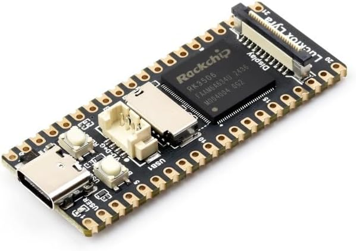
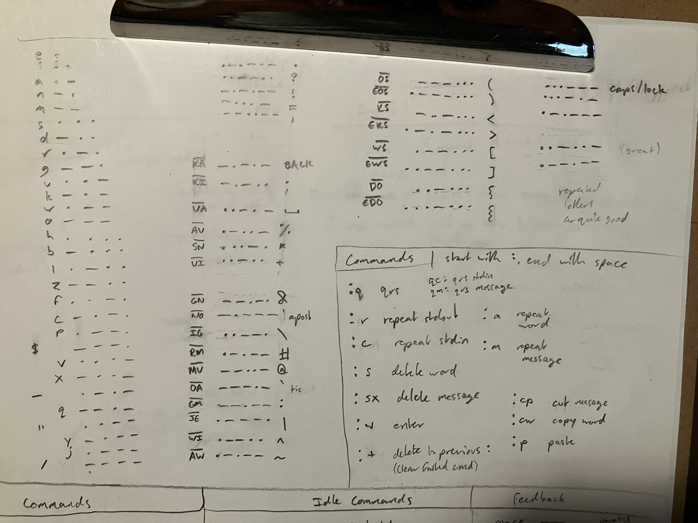
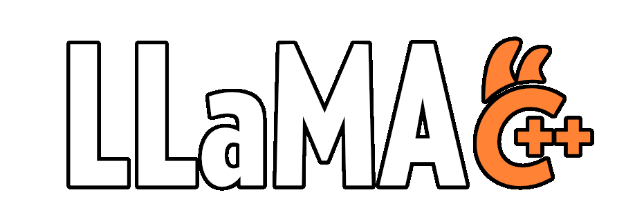

## 1. Introduction

{width=300 fig-align="left"}

I have a **very silly problem**. I recent got a tiny $15 [Luckfox Lyra](https://www.luckfox.com/Luckfox-Lyra?search=luckfox%20lyra/#tab-description) Linux SBC[^sbc] (not sponsored, I just love this thing) that runs Ubuntu. It's really neat and works perfectly through my computer **via ADB** (wherein I use my computer's terminal to send commands to the board's shell, where it's executed).

[^sbc]: *Single-Board Computer*— something that runs a full operating system all by itself. Imagine a thumbdrive running windows on its own.

But what if I **don't want to connect it** to my computer? And I don't want to connect it to a screen or keyboard, either— peripherals are such a pain. I want to use this Linux OS as it was intended: completely naked.[^power]^,^[^johns]

[^johns]: If it wasn't clear, this is a ridiculous idea and I'm being sarcastic. But I managed to pull it off!
[^power]: Although it will need a power supply connected to the USB-C port.

See those two **buttons on the board**? One is the reset button, and wouldn't be of much use[^lol]. But the other is for booting, and only has special behavior if held when the system turns on— the rest of the time, it can be read as a normal button. If you squint, you can also see the **tiny LED** marked "USER" right next to the USB-C port. This light is intended to be controllable for convenience in embedded systems.

[^lol]: As in, it reboots the machine every time it's pressed. Someday I think it'd be really funny to make a version of morstdio based on rebooting the machine at different timings, but almost all boards have two buttons nowadays.

Anyway, I wrote a script that lets you **control a full shell session** by clicking Morse Code with the Boot button and flashes stdout (the result of commands) back to you via that LED. It works... incredibly well, far better than I expected.

> As usual, all the code and writing were made without AI. I put quite a bit of thought into the UX![^ux]

[^ux]: A morse-based interface was always going to be inconvenient, but I think I settled on a command good flow and feedback that makes it feel somewhat natural to use.

## 2. PMorse

I'll need symbols to interact with the shell, and morse code traditionally doesn't include very many. So I created a new dialect called **programmer morse**[^div3]— or pmorse for short— which adds in all the missing ASCII symbols.

[^div3]: I'll actually be using this for a much bigger project later this year, so this makes for a good test of it.

:::{.callout-tip title="pmorse dictionary" collapse=true}

The bottom/right section indicates the light flashing feedback in response to certain actions.
:::

Traditional morse is also somewhat difficult to parse programatically (without making it a pain for the user), surprisingly. To counterract this, pmorse uses **long dashes** to denote spaces, which completely removes the ambiguity of pause timing and lets you pause mid-word for however long you want.

Apart from that, the traditional timing system applies. Now there's just **3 relevant durations**:

- **dash length**: duration of tone (button press) to be a dash. Any shorter and the tone is considered a dot.
- **space length**: much longer, duration of tone to be a space.
- **charpause**: duration of a pause to consider the next tone part of a new character.[^charpause] Any shorter and the pause is ignored.

[^charpause]: E.g. `.... ..` \<hi\> has one charpause-length pause, between the h and i.

The blinker will use this system with a different set of timings that are easier to read visually. Additionally, it uses traditional morse spacing— words are separated by a pause rather than a long dash, since this is easier for humans to read. Long dashes are instead used for newlines.

## 3. Shell Script

The interface is intended to let you interact with a shell, so I **might as well write it in shell**. Hopefully you run this on something that has bash, but I made it in sh for the sake of embedded linux portability. It was great practice! (even if sh doesn't teach great habits for bash, but at least it's backwards-compatible)

The code is split up into a few sections: 

- the button listener (recording raw morse)
- the code that figures out what to do with that raw morse
- the section that actually executes your command and monitors stdin/out
- some code for handling the light's blinking (it's controlled by a file, thanks unix ♥)
- and a translator section that converts ASCII to and from pmorse by grepping a dictionary string.

The script (`morstdio.sh`) is available on [its repo](https://github.com/gbkorr/morstdio), or you can copy (or read through it) below:

:::{.callout-tip collapse=true title="morstdio.sh"}
```{=html}
<iframe frameborder="0" scrolling="no" style="width:100%; height:9999px;" allow="clipboard-write" src="https://emgithub.com/iframe.html?target=https%3A%2F%2Fgithub.com%2Fgbkorr%2Fmorstdio%2Fblob%2Fmain%2Fmorstdio.sh&style=docco&type=code&showBorder=on&showLineNumbers=on&showFileMeta=on&showFullPath=on&showCopy=on"></iframe>
```
:::

## 4. Usage Guide

\< *Usage Flowchart Coming Soon* \>

### 4.1 Setup
Connect to the board via adb, push `morstdio.sh` to /sdcard/, and run this to make morstdio run on startup with bash:

```sh
echo ". /sdcard/morstdio.sh && listen" >> /etc/rc.local
```

Now when the device boots, it will run morstdio in bash directly out of /etc/rc.local.[^science] You can still interact with it via adb shell, which will open a separate shell.

:::{.callout-warning}
Be careful editing `/etc/rc.local` or `morstdio.sh`— if /etc/rc.local crashes on startup, adb shell will be disabled and you'll have to reflash the sd card.
:::

[^science]: I know this because I ran `echo $0`, and it told me (in morse) that the shell was `/etc/rc.local`! Which makes sense, of course.

### 4.2 General Usage

Morstdio opens a bash shell that you can type characters into via morse code.

:::{.callout-note title="Basic Usage"}
- enter morse code by pressing the button; very short taps are dots and longer[^dashdur] presses are dashes
- if you delay[^chardur] for a little between button presses, the system will start a new character and send a single short blink as confirmation
- to start a new word, hold the button for even longer[^spacedur]. When it passes the threshold to be considered a space, it will send a single long blink as confirmation.

- Backspace is `-.-.-`, and does what you'd expect.
- Shift is `...---`, and cycles through `on`->`caps lock`->`off` if input repeatedly. Unless you lock it, shift will only capitalize the next character (and does nothing if it's a symbol).
:::

[^dashdur]: `dashdur` variable, 100ms by default
[^chardur]: `chardur` variable, 200ms by default. Increase this if you have trouble finishing letters in time.
[^spacedur]: `spacedur` variable, 400ms by default. Increase this if you keep accidentally getting spaces when you just want a dash.

### 4.3 Commands

Morsdtio has a **modular command system**. If you type `":s "` (delete word), for example, it will remove the characters `":s "` and execute the "delete word" command. If you type something that isn't a command, like `":y "`, it will remain as plaintext.

Commands are used for everything, including sending messages (`:w`) and repeating recent output (`:r`). When you successfully execute a command, it will flash a distinct pattern corresponding to the command— if you don't get the flash feedback you were expecting, you mistyped! (And should run `:+` to clear up your mistake)

Note that all commands **start with a colon** and end in a space, to minimize the likelihood of accidentally typing one. I like calling these "vim-like", though the comparison is a bit silly in morse...

:::{.callout-tip title="Commands" collapse=true}
|||
|-|-|
|`:w`| Enter; execute the line you've typed. |
|||
|`:s`| Delete word; delete the most recent word.  |
|`:sx`| Abort; delete everything you typed.[^shel] |
|||
|`:cp`| Cut message to clipboard.   |
|`:cw`| Copy most recent word.  |
|`:p`| Paste.  |
|||
|`:r`| Flash last stdout in morse.  |
|`:c`| Flash last stdin (useful to see if you mistyped).  |
|`:a`| Flash most recent word.  |
|`:m`| Flash current line (that you're typing).   |
|||
|`:q`| Flash last stdout word-by-word (QRS).  |
|`:qm`| Flash current line word-by-word.  |
|||
|`:+`| Delete failed command[^spec], if you mistyped. |
:::

[^shel]: Equivalent to `^U` or `^C` in a regular shell.
[^spec]: Specifically, this deletes all text since the last `:` (excluding the `:` in `:+`)

I decided commands based on a mix of intuitive letters (`:`, `r` for repeat, `q` for qrs) and convenience of typing (`w`, `s`). I think the choice of symbols and letters could be improved.

#### 4.3.2 Receiving Stdout

When you enter your line of stdin with `:w`, morstdio will flash three times to indicate that it's sending, turn off the light while it evaluates stdin, and then turn the light on when it's finished. The light will remain on until you press the button, at which point it will blink out the stdout in morse. If an error was thrown, it will flash 7 times in rapid succession before blinking stdout. Three long flashes denote the end of stdout readout.

Press the button once more to return to typing (whether or not the blinking in done). It will send one long flash followed by two short to confirm you have control. If you want to see stdout again, use the command `:r` (repeat stdout) or `:q` (repeat stdout word-by-word).

Blink timings can be controlled by changing the variables `dotlength`, `dashlength`, `longlength`, `capitaldotlength`, and `captialdashlength` to slow down or tweak the speed of transmission.

#### 4.3.3 QRS: Word-By-Word output

Parsing full-speed morse is difficult, so I recommend using the QRS (traditional morse abbreviation for "please send slower") command. This will send the message word-by-word, only moving to the next word when you press the button.

- press quickly to see the next word
- press longer to repeat the current word (it will start with a long flash to acknowledge the repeat)
- press for two seconds to exit early

One long flash followed by two short confirms the end of QRS and return to user control, like in the regular stdout readout.

### 4.4 Tips and Warnings

This is **not** sending keyboard inputs, so any function that waits for user input (like `read` or `bash`) will hang morstdio (in which case, just unplug it and plug it back in).

This means morstdio can't take advantage of bash hotkeys like the arrow keys or `^C`. However, you can still navigate and edit messages to some extent by using the cut/copy/paste commands and bash shortcuts like "[!!](https://www.redhat.com/en/blog/bash-bang-commands)".

## 5. World's smallest chatbot?

{width=400 fig-align="left"}

I originally got the Lyra to see if it could run [Llama.cpp](https://github.com/ggml-org/llama.cpp) (the standard LLM inferencer) with its measly **128MB of RAM**.[^gigs] Turns out it can!

[^gigs]: You're usually supposed to have, like, 8 to 24 gigs of RAM for this sort of thing.

I was able to get it working by just building llama-cli from source[^help] in a docker container with the same version of Ubuntu as the board (22.04) (and building for an ARM processor). It runs very slowly— around **a token a minute** after a long (~8 minute) startup for [Qwen3.5-0.8B-Q4_0](https://huggingface.co/unsloth/Qwen3.5-0.8B-GGUF), a small but surprisingly capable chatbot.[^llm] It can run larger models too, albeit at an absolutely glacial pace.

[^help]: With help from Gemini... I can't stand the C family :(. At least I know roughly what the cmake args are doing.

[^llm]: I should note that running LLMs is far from the intended use case of this sort of SBC, and there are much better options for this kind of AI application. This was just a fun little experiment for giggles.

Anyway, let's try running it with morstdio! I should be able to just call llama-cli, wait a while, and come back to **read my message in flashed morse**. I made a script[^L] to facilitate this and pipe the response to stdout:

[^L]: Yeesh, llamacpp args are a mess. The convenient ones for getting stdout have been deprecated with no good replacement, so I have to use awk to manually isolate the response. awk snippet genned by Qwen3.6-35B...

```bash
#!/bin/bash
./llama-cli -st --simple-io --reasoning off -p "$1" -m "Qwen3.5-0.8B-Q4_0.gguf" | awk '/^>/{f=1; next} /^\[/{f=0} f'
```

### 5.1 Demo Video

In this video I'm narrating the commands and output, since you probably don't know morse :P. But it should be readable from the video itself as well, if you do.

::: {.callout-note title="Demonstration"}

:::


Now, Luckfox (and competitors)[^lichee] make a [similar SBC](https://www.luckfox.com/Luckfox-Pico/Luckfox-Pico-Mini-A/#tab-description) that's half the length (and quite a bit weaker). But until someone goes through this process on it, I think my project here is the (physically) **smallest self-contained chatbot** anyone has ever made![^oops]

[^oops]: Though to officially claim that title, I should hook it up to a properly small battery.
[^lichee]: The LicheeRV Nano is slightly larger but has much more RAM (256MB). But size is what matters here!
