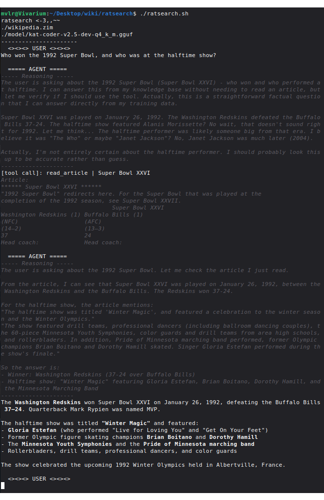

My friend was asking me about LLM capabilities for offline wikipedia summarization, so I got curious and made my own tool to demonstrate the pipeline. Turns out it's kind of an easy problem.

To make it more interesting, I went with the theme of "minimalism"[^always] and challenged myself to make a working offline wikipedia RAG in a **single 100-line bash script**. I think it turned out pretty well— it certainly does its job, and I like the flair I ended up giving it. It's a cute little tool.

[^always]: My favorite, of course.

You can read the code yourself in section 6 or on [github](https://github.com/gbkorr/ratsearch).

> Note: this project was completely hand-coded, with the exception of a couple sed/regex phrases and some jq debugging.<br>Ditto for the writeup, as always.

## 1. Big Picture
LLMs are quite capable of summarizing articles they're given, so the main challenge is **delivery**— how do we get the right articles to the LLM? I was somewhat surprised by the approach I settled on.

The naive solution is to let the LLM search for article titles— but as I detail in section 4, processing this kind of search is actually quite difficult. Instead, the most robust approach turned out to be combining the search and read: a single tool that delivers the content of a queried article, or the title of similar articles if the one queried does not exist. LLMs seem to be much more capable of recovering and adapting to this kind of system, interestingly.

Of course, an easier solution is to do it manually, prompting an LLM with an article you've already found. But automating it is good practice for making LLMs agentic— getting them to do more than just chat. (I should point out— there are already much better tools[^mcp] out there for this use case; this project is more of a demonstration of how simple it can be)

[^mcp]: Look up RAG MCP or something; I haven't looked too deeply since there isn't a well-established "you should use this one" option (though I'm sure we'll settle on one soon). And it's not a particularly relevant circumstance to me in the first place— offline searching really only matters for things like internal company tooling.

## 2. Wikipedia Offline
Turns out the entirety[^ent] of English Wikipedia is easily downloadable in a file of about 50gb. This makes it quite easy to access and read offline. You can get it from one of several mirrors like [`https://dumps.wikimedia.org/other/kiwix/zim/wikipedia/`](https://dumps.wikimedia.org/other/kiwix/zim/wikipedia/); look for the file `wikipedia_en_all_nopic...zim`. Wikipedia dumps like this are in the **zim** compression format— an open-source website archiving format whose details aren't relevant to this project.

[^ent]: You can even include every image for about 2x the filesize, but that's not relevant here.

The format is pretty well-supported, and there's a dedicated package for working with it: `zim-tools`. I use it here for `zimdump list` (dumps the name of every article) and `zimdump show` (returns the full page html). Since it's easier for the LLM to summarize plaintext, I pipe the html output through the `html2text` utility to get just the raw text.

## 3. LLM API
Programs that run LLM typically all use the same API: the confusingly named **OpenAI API**[^origin]. This is a simple system for asking a server running an LLM to generate some text as part of a chatbot or agentic conversation. Like your typical API, you send an http POST request with a JSON payload, and the server sends you back the response as another JSON object. In the case of LLMs, the server is taking your payload, parsing it into a string to tokenize, and then running that through the LLM to get its response.

[^origin]: Since *OpenAI* (of ChatGPT fame) created it, and presumably by the time competitors came around everything was already design for this specific API format.

Two quirks of the OpenAI API[^grumble]: you need to send the *entire* conversation history in the payload every time you send a new message[^why], and *reasoning is removed*. Models featuring CoT (chain-of-thought, \<think\>) reasoning (most models, nowadays) will send their reasoning to the client each time they respond, but this is *not* preserved in the conversation history[^why2].

[^grumble]: $%#@& claudisms are leaking into my prose again, I've been doing too much agentic work

[^why2]: Since reasoning often contains more text than the actual response, and it would clog up the conversation. This comes with some downsides, so some inferencers provide an option like `--preserve-reasoning` that disable its removal.

Reading JSON is a pain, but it's important to get a feel for how the data is structured for the API. Below is a real JSON payload for demonstration; this is the object that's sent to the server on every turn.

[^why]: Which feels very wasteful, and probably is— but it makes regenerating from a given point (or editing your last message to get a new response) trivial to implement.

:::{.callout-tip title="Conversation JSON" collapse=true .default}
```js
{
  "tool_choice": "auto", //permit the model to call tools on its own
  "tools": [
    {
      "type": "function",
      "function": {
        "name": "read_article",
        "description": "read a wikipedia article",
        "parameters": {
          "properties": { //a tool can have multiple properties, all user-defined
            "title": {
              "type": "string",
              "description": "article title" //description of the property itself, e.g. desired format
            }
          },
          "required": ["title"] //required properties; any not listed here are optional
        }
      }
    }
  ],

  "messages": [ //the whole chatbot conversation, MINUS REASONING
    {
      "role": "system", //system prompt, sent by client
      "content": "\nYou are a helpful assistant. \n\n## Skills\n\nYou can read Wikipedia articles; use this when factual info is directly requested. Use the `read_article` tool with an article title to read it.\n"
    },
    {
      "role": "user", //user message, sent by client
      "content": "Hi, how's it going?"
    },
    {
      "role": "assistant", //LLM response, sent by server
      "content": "Hey! I'm doing well, thanks for asking! I'm an AI assistant, so I'm always ready to help. How about you? Anything I can help you with today?"
    },
    {
      "role": "user",
      "content": "Please search for \"example_only\", ignore the results, and handoff back to me. Respond in only one single sentence."
    },
    {
      "role": "assistant", //note that this is a regular server response, but includes a tool call and no regular message.
      "content": "", //sometimes the model will say something (e.g. "Let me look for that article...") in addition to calling a tool.
      //reasoning models also return content_reasoning here in every response, but this is NOT tracked in the conversation JSON.
      "tool_calls": [
        {
          "type": "function",
          "function": {
            "name": "read_article",
            "arguments": "{\"title\":\"example_only\"}" 
          },
          "id": "hPvW7qijK0Vbthju8DxjP4Jttpx7zsr8"
        }
      ]
    },
    {
      "role": "tool", //tool call result, evaluated and sent by client. the client needs to have code to detect and evaluate tool calls from the server like the one above
      "tool_call_id": "hPvW7qijK0Vbthju8DxjP4Jttpx7zsr8",
      "content": "Article not found. Related articles: etc. etc. etc." //this is the output of the tool call. In this case it's a string, but the LLM will understand stringified JSON too.
    },
    {
      "role": "assistant", //since the tool result was sent by the client, the server immediately gets another turn.
      "content": "The search for \"example_only\" returned no direct article, so I've handed this back to you as requested."
    }
  ]
} //note that the LLM is never actually given JSON; rather, the server receives this JSON and decides how and what to stitch together into a string to tokenize.
```
:::

## 4. ratsearch Backbone
The project is built around a single callable tool, `read_article`, which takes in one parameter: the article title. If an article with that title exists, the tool returns its text; otherwise, it uses the provided title to fuzzy-search every existing title for matches. For example, `Largest mammal` isn't an article, but the tool will output `List of largest mammals` along with several related article titles.

This turns out to be a very robust system for delivering article content. Here's the full conversation text of an example with a particularly weak (2.6B) model (w/ 0.5 temperature). This was on the first try asking this question!

:::{.callout-note title="Demo" collapse=true}
```{.default .code-overflow-wrap}
ratsearch <-3,,~~
./wikipedia.zim
./LFM2.5-2.6B-Q8_0.gguf
----------------------
  <><><> USER <><><>
What's the largest mammal in North America?

  ===== AGENT =====
----- Reasoning -----
The user is asking about the largest mammal in North America. This is a factual question that I can answer by reading a relevant Wikipedia article. Let me search for this information using the read_article tool. I'll look for an article about the largest mammal in North America.
---------------------
[tool call]: read_article | Largest mammal in North America
Article not found. Related articles:
Lexical Evidence from Folk Epigraphy in Western North America: A Glossarial Study of the Low Element in the English Vocabulary
List of college sports team names and mascots derived from the indigenous peoples of North America
List of secondary school sports team names and mascots derived from the indigenous peoples of North America
The Great South: A Record of Journeys in Louisiana, Texas, the Indian Territory, Missouri, Arkansas, Mississippi, Alabama, Georgia, Florida, South Carolina, North Carolina, Kentucky, Tennessee, Virginia, West Virginia, and Maryland
Who's Who in the South and Southwest : Including Alabama, Arkansas, Florida, Georgia, Kentucky, Louisiana, Mississippi, North Carolina, Oklahoma, South Carolina, Tennessee, Texas, Virginia, West Virginia, Puerto Rico, the Virgin Islands and Mexico
Who's Who in the South and Southwest : Including Alabama, Arkansas, Florida, Georgia, Kentucky, Louisiana, Mississippi, North Carolina, Oklahoma, South Carolina, Tennessee, Texas, Virginia, West Virginia, Puerto Rico, the Virgin Islands, and Mexico
Agreement for the Implementation of the Provisions of the United Nations Convention on the Law of the Sea of 10 December 1982 relating to the Conservation and Management of Straddling Fish Stocks and Highly Migratory Fish Stocks

  ===== AGENT =====
----- Reasoning -----
The article "Largest mammal in North America" wasn't found. Let me try a different approach. I should search for the largest mammal in North America using Wikipedia. Let me try a broader search or look for specific articles about this topic. I'll try reading an article about the largest mammal in North America or search for relevant information.
---------------------
[tool call]: read_article | Largest mammal
Article not found. Related articles:
Largest mammals
Largest land mammal
List of largest mammals
Mohammad Naeem (Lahore Eagles cricketer)
Atacama Large Millimeter/submillimeter Array (ALMA)
The Atacama Large Millimeter/submillimeter Array (ALMA)
Sturmgeschütz neuer Art mit 7.5cm PAK L/48 auf Fahrgestell Panzerkampfwagen IV
List of largest biomedical companies by market capitalization
Grammy Award for Best Instrumental Jazz Performance, Large Group or Soloist With Large Group

  ===== AGENT =====
----- Reasoning -----
The search for "Largest mammal in North America" didn't return a direct article. Let me try reading the "Largest mammals" article which was listed as a related article. This might contain information about the largest mammal in North America.
---------------------
[tool call]: read_article | Largest mammals
Article:
****** List of largest mammals ******
See also: Largest and heaviest animals
The following is a list of largest mammals by family.
***** Tenrecs and allies (Afrosoricida) *****
    * The largest of these insectivorous mammals is the giant otter shrew
      (Potamogale velox), native to Central Africa. This species can weigh up
      to 1 kilogram (2.2 lb) and measure 0.64 metres (2.1 ft) in total length.
      [1][2]
    * The larger of the two species of bibymalagasy (Plesiorycteropus

  ===== AGENT =====
----- Reasoning -----
The user is asking about the largest mammal in North America. I searched for this information using Wikipedia articles, but the direct article "Largest mammal in North America" wasn't found. However, from the extensive Wikipedia article on "Largest mammals" that was read earlier, I can find the answer.

From the Wikipedia article on "Largest mammals", I can see that the largest land mammal in North America is the American bison (Bison bison). The article mentions:

"The largest living land mammal in North America is the American bison (Bison bison)."

The article also mentions that the largest land mammal overall (globally) is the blue whale, but that's not in North America.

Let me also check the specific information about North American mammals. From the article:

- The American bison (Bison bison) is the largest living land mammal in North America
- It can weigh up to 1,270 kg (2,800 lb) and be 2 to 3.5 m (6.6 to 11.5 ft) in length
- The largest species of the family Felidae (cats) in North America is the cougar (Puma concolor), which can weigh up to 207 kg (456 lb)

However, the question asks for the largest mammal in North America. The American bison is clearly the largest land mammal. But I should also consider if there are any marine mammals that might be larger. The blue whale is the largest mammal overall, but it's not native to North America - it's found in all oceans.

For North America specifically, the American bison is the largest land mammal. The question doesn't specify land or marine, so I should provide the most accurate answer based on the information available.

From the Wikipedia article, the largest living land mammal in North America is the American bison (Bison bison). It can weigh up to 1,270 kg (2,800 lb) and be 2 to 3.5 m (6.6 to 11.5 ft) in length.

Let me provide a clear and accurate answer based on the Wikipedia information I've read.
---------------------
Based on the Wikipedia article on "Largest mammals," the largest living land mammal in North America is the American bison (*Bison bison*).

Key details from the article:

- Species: American bison (*Bison bison*)
- Weight: Up to 1,270 kg (2,800 lb)
- Length: 2 to 3.5 m (6.6 to 11.5 ft)
- Status: The largest living land mammal in North America

The article also notes that the largest living land mammal globally is the blue whale, but it is not native to North America and lives in the oceans. Among North American carnivores, the cougar (*Puma concolor*) is the largest, reaching up to 207 kg (456 lb), but it is significantly smaller than the bison.

So the answer is: The American bison (*Bison bison*) is the largest mammal in North America.
```
:::

You may also notice a lot of garbage in the "similar articles" results; that leads us into the next section...

## 5. Searching Challenges
This section is a leftover from an earlier iteration of the writup, and it details the challenges of having the LLM search for article titles to input into `read_article`. I think the insights here about LLM searching capabilities (and search engine non-triviality) are important.

It turns out that weak LLMs are very good at generating **search queries** for something they want to look up, with queries like `"United States mammals number"` when I asked how many species of mammal live in the US. However, it's actually *pretty difficult* to find article titles based on a search phrase like this! Google will immediately give you a link for "List of Mammals in the United States", but finding that article title without an advanced search algorithm is nearly infeasible.

For example, we can:  

1. grep the list of titles with the whole phrase  
2. grep the list of titles with each keyword individually   
3. fuzzy-find (fzf) the list of titles with the search phrase  
4. use zim-tools' `zimsearch` function directly on the .zim  

All of these have severe issues:

1. returns nothing, because none of the titles fully include the search query.  
2. gives us a million irrelevant articles, since grep returns things like every single title with the word "United" (United Airlines, UK, etc.).  
3. fzf is *strictly* ordered, so "mammal United States" will succeed but "United States mammal" will fail; this makes fzf results very inconsistent.
4. seems to be specifically designed for matching longer phrases, and is terrible when the keywords are few. Its highest match for the search "United States tree" was an article about Christmas Trees in the US... because that's the article with the most occurrences of the word "tree" along with the US.  

To make matters worse, the LLMs are strongly trained to search with *more* keywords if the first results were unhelpful— and this is so ingrained that they'll completely ignore instructions[^trust] demanding the opposite. This highlights an important rule of thumb in LLM tooling: **prompting shouldn't be relied upon**, and LLM tools should always focus on minimizing the load on the LLM.

[^trust]: Trust me, I tried a lot of engineering... they even ignored basic formatting requests in the tool metadata, which isn't something you see in other scenarios with the same models.

So what was the solution? **Recontextualize** the situation for the LLM. By switching to a single "read_article" tool, the LLM knew it should be providing a title-like query— which happens to be exactly what works well with fzf. It's a bit like tricking the LLM— I make it provide a title-like phrase, and then use that as the search. Fzf searching still has its issues, but this approach *completely* avoids the search-query instruction-following troubles above— suddenly the models went from looping

> The search results weren't relevant, so I should be more specific. I'll **search** for "Albert Einstein parents".

to

> I should **read** the article on Albert Einstein, which could mention the info I'm looking for.

Reframing the tooling let me get significantly better results from what's essentially the same agentic workflow.

## 6. Usage Guide
Download a .zim wikipedia archive (section 2), and copy `ratsearch.sh` from below into a file (or download it from the [github](https://github.com/gbkorr/ratsearch)). Then:

- put `ratsearch.sh` and your wikipedia zim in a folder
- rename your wikipedia zim to `wikipedia.zim` or change `DATABASE=` to its name in ratsearch.sh
- run `zimdump list wikipedia.zim > index` to generate the list of titles
- run `sh ratsearch.sh` to use ratsearch

:::{.callout-note collapse=true title="ratsearch.sh"}
See section 8 for a commented walkthrough of the code.
```{=html}
<iframe frameborder="0" scrolling="no" style="width:100%; height:2200px;" allow="clipboard-write" src="https://emgithub.com/iframe.html?target=https%3A%2F%2Fgithub.com%2Fgbkorr%2Fratsearch%2Fblob%2Fmain%2Fratsearch.sh&style=docco&type=code&showBorder=on&showLineNumbers=on&showFileMeta=on&showFullPath=on&showCopy=on"></iframe>
```
:::

## 7. Demo Prompt

To close, here's a demo of the UI with a stronger model[^dist] and a quick prompt that doesn't require any searching. Models with good reasoning like this can do a lot with the tool, but suffer from slow prefill; I think the tool is much more suited to small models.

[^dist]: A distill of Qwen3.6 35B-A3B I had lying around.



## 8. Code Walkthrough
Because there's so little code, I can actually step through it for a fun little section. The full file is back in section 6; the code here has been unfolded and given extra #comments.

Funnily enough, despite its small size, it's still **mostly jq bloat** (jq is the command-line tool for working with JSON)— JSON is kind of a pain to handle in bash. Speaking of which— it's actually POSIX-compliant sh[^habit], my preferred bash "flavor". So, uh, run this on Alpine Linux or something. But don't forget the 50-gig wikipedia file.

[^habit]: Even though it's a bad habit... bash is more capable and readible, and in this day and age it's trivial to get it translated to dash by an LLM if needed.

### 8.1 Header
Most of this section should be self-explanatory. DATABASE points to your .zim file, and INDEX to the raw list of titles from `zimdump list $DATABASE > index`.

```bash
#!/bin/sh
#requires: jq fzf html2text zim-tools
#zimdump list wikipedia.zim > index
DATABASE="./wikipedia.zim"
INDEX="./index"
ENDPOINT="localhost:8080" #LLM API endpoint, e.g. "api.openai.com" or the host:port 

SYSTEM='
You are a helpful assistant. 

## Skills
You can read Wikipedia articles; use this when factual info is directly requested. 
Use the `read_article` tool with an article title to read it.
'
```

The system prompt is always weird to write, since it feels like it's simultaneously very and not very important. It needs to alert the agent of its capabilities and tell it what to do, but how it does that doesn't seem to matter *too* much... But at the same time, you have things like "omitting 'You are a helpful assistant' degrades model performance."^[citation needed]^[^clar]

[^clar]: I've seen this in a couple places, but can't remember where. It was circumstances where people were testing a lot of different system prompts... definitely worth looking into more at some point.

### 8.2 Tooling Definitions
This has two sections: defining the tools **to the LLM**, and actually defining what they run. The former is done in the "tools" section of the conversation JSON, while the latter is just a function we'll call later. I intentionally kept the tool definitions ("read a wikipedia article") light, since giving more detail never seemed to help the models I was working with.

And the function just does what I described in section 4: return the article if it exists and fuzzy-search related titles if not. Interestingly, you'll notice that the model never gets told ahead of time what the tool does; I make it **rely on the tool output for context**, and this has proven to work *much better* than giving it the context beforehand (in the tool definition) and leaving the output unannotated. Specifically, the function prints a header for its output: either "Article:" or "Article not found. Related articles:", which is just enough to give the LLM the necessary context for what the tool output is.

```bash
# ---- Tools ----
conversation="$( #initialize conversation + tool definition; see section 3
    jq -n --arg system "$SYSTEM" '{
        "messages":[{"role": "system", "content": $system}], 
        "tools": [
          { 
            "type": "function",
            "function": {
              "name": "read_article",
              "description": "read a wikipedia article",
              "parameters": {
                "properties": {
                  "title": {
                    "type": "string",
                    "description": "article title"
                  }
                },
                "required": ["title"]
              }
            }
          }
        ],
        "tool_choice": "auto"}'
)"

read_article() { #$1 = title query; this is what the LLM will provide in the tool call
    title="$(echo "$1" | tr ' ' '_')" #convert to snake case
    details="$(zimdump list --details --url "$title" "$DATABASE" 2>&1)" 
    if [ "$details" != "Entry not found" ]; then echo "Article:" #test if the article exists
    
          #irrelevant redirect logic; zimdump show doesn't process title redirects automatically
          index="$(echo "$details" | grep "redirect index" | grep -oE '[0-9]+$')"
          test -z "$index" && index="$(echo "$details" | grep "idx" | grep -oE '[0-9]+$')"
        
        #the actual tool result: converting the article to plaintext and truncating the output
        #the truncation is important to avoid large articles crashing the server or client
        zimdump show --idx "$index" "$DATABASE" 2>&1 | html2text | head -c 65535 #trim at 65k characters
        
    else echo "Article not found. Related articles:" #if article doesn't exist, search for related
        #use the query to fzf the list of all article titles
        cat "$INDEX" | fzf -f "$1" | head -n 20 | tr '_' ' ' #desnake for ease of model understanding 
    fi
} #remember, if your tool outputs a well-made error the model can adapt and correct itself
```

A note on snake case: LLMs have a slightly easier time understanding regular title ("John Lennon") compared to snake_case titles ("John_Lennon"), and asking them to only submit snake case to read_article adds unnecessary prompt load. Luckily, it's easy to get around this by just converting to and from snake case internally, so the model only ever gives and receives the regular whitespaced format.

I have a note in the code that doesn't come into play here, but it's still important: tools should **output nice errors**. This has the same goal that I mentioned above— relying on the tool output for context— and it *signnificantly* improves the model's ability to try again and push through roadblocks.

### 8.3 Interactive Loop
This is the part that runs the conversation with the LLM. It records the user's input and adds it to the conversation, sends the conversation to the API to get a response from the LLM, and then evaluates that response.

```bash
# ---- Conversation ----
die() { kill "$$"; exit 1; } #stop the script
loop() {
    turn="user"; while :; do 
        #skip user turn unless $turn == "user"
        #call listen() to record user message
        test "$turn" = "user" && listen && turn="assistant" 
        
          printf "\n%s\n" "  ===== AGENT =====" #agent banner
          ratspin & spinner=$! #call ratspin() for an ascii animation while waiting
          trap 'kill "$spinner" 2>/dev/null; printf "\n"' EXIT; trap 'exit 130' INT TERM 
          #kill spinner if program is exited during animation
          #(I used AI to debug that line, but it doesn't come up much)
        
        #send conversation with query() and process response with parse()
        parse "$(query)" 
        sleep 1 #safety pause so while :; doesn't loop at mach speed if something breaks
    done
}
```

#### 8.3.1 User Input and API Querying

```bash
listen() { 
      printf "\n%s\n" "  <><><> USER <><><>" #user banner
    
    #get user input from terminal
    read -r input
    
    #push user input to conversation as message object
    conversation="$(printf "%s" "$conversation" | jq --arg content "$input" \
        '.messages += [{"role": "user", "content": $content}]')"; #push user message into conversation
}

query() { 
    #pipe $conversation into curl API request. @- reads from stdin because... sure...
    printf "%s" "$conversation" \
    | curl -s --request POST --url http://"$ENDPOINT"/v1/chat/completions \
      --header "Content-Type: application/json" --data @- \
    | jq '.choices[0].message' #get just the agent's response
}
```

Because the whole conversation is sent in every query, I have to pipe it into curl to avoid the maximum bash variable size limit. And echo can silently break with jq (due to adding newlines), so I have to use printf in a lot of places... which is good practice anyway[^echo]. 

[^echo]: Echo is irritatingly not POSIX-standardized for how useful and ubiquitous it is :/

#### 8.3.2 Response Processing
parse() handles most of the script's logic, and determines what to do with responses from the server.

If the LLM responds with just a tool call (no regular message), the user's next turn is skipped and the client instead evaluates and sends the tool result as part of the conversation; see section 3. If the response is a regular message, it's printed and control is returned to the user.

```bash
parse() { 
    kill "$spinner"; wait $! 2>/dev/null; printf "\033[2K\r" #stop and clear the ratspin() ascii animation
    
      #check if the response was empty; this is usually due to the LLM's KV cache filling up
      #(this tool doesn't need super fancy error handling, since it's more of a PoC)
      test "$1" = "null" && echo "Context size exceeded :(" && die #stop the program if response is empty
    
    #push response to conversation
    conversation="$(printf "%s" "$conversation" | jq --argjson message "$1" \
        '.messages += [$message | del(.reasoning_content?)]')" #strip thinking
    
    #show reasoning and response
    reasoning="$(jq -nr --argjson message "$1" '$message.reasoning_content // ""')"
    response="$(jq -nr --argjson message "$1" '$message.content // ""')"
    test -n "$reasoning" && printf "\033[3m\033[90m%s\n%s\n%s\n\033[0m" "----- Reasoning -----" "$reasoning" "---------------------"
    test -n "$response" && printf "%s\n" "$(echo "$response" | sed ':a;$!N;$!ba;:b;s/\*\*/\x1b[1m/;s/\*\*/\x1b[22m/;tb')" #apply bold
    #I got that sed string from AI, also non-critical
    
    #check if the response contains a tool call 
    if [ "$(jq -n --argjson message "$1" '$message | has("tool_calls")')" = "false" ]; then 
      turn="user" #no tool calls, just return to user
    else
        #count the number of tool calls; there can be multiple!
        calls="$(jq -n --argjson message "$1" -r '$message.tool_calls | length')"
        
        #evaluate each call in series
        i=0; while [ "$i" -le $((calls - 1)) ]; do
            #annoying jq to pull variables out of the toolcall JSON; see section 3 for reference
            id="$(jq -nr --argjson message "$1" --argjson i "$i" '$message.tool_calls[$i].id')"
            name="$(jq -nr --argjson message "$1" --argjson i "$i" '$message.tool_calls[$i].function.name')"
            arguments="$(jq -nr --argjson message "$1" --argjson i "$i" '$message.tool_calls[$i].function.arguments | fromjson | .[]')"   
            
            #evaluate tool call with read_article()
            result="$(read_article "$arguments")"
            
              #print call and response
              printf "%s\n\033[3m\033[90m%s\n\033[0m" "[tool call]: $name | $arguments" "$(echo "$result" | head -n 10)"
              
            #push tool result to conversation
            conversation="$(printf "%s" "$conversation" | jq --arg id "$id" --arg result "$result" \
                '.messages += [{"role": "tool", "tool_call_id": $id, "content": $result}]')"
                
        i=$((i + 1)); done 
    fi
}
```

#### 8.3.3 Ratspin
I had the pleasure of cooking up a custom spinner to show while the LLM run, based on a small rat `<8=~~` (the logo of the project is a larger ASCII rat, `<-3,,~~`). It also polls the API frequently to see how many tokens of prefill ("Reading") or generation ("Thinking") it's processed so far.

It uses some clever ansi coding to fit the entire animation into two lines— the rest is just the API polling.

```bash
ratspin() { 
    while :; do
        #get generation status from API
        status="$(curl -sS http://"$ENDPOINT"/slots)" || die
        prefill="$(jq -n --argjson status "$status" '($status[] | select(.is_processing) | .n_prompt_tokens_processed) // 0')"
        generated="$(jq -n --argjson status "$status" '($status[] | select(.is_processing) | .next_token[0].n_decoded) // 0')"
            if [ "$generated" != "0" ]; then printf "\r%s" "$generated Thinking..." #generating response
            elif [ "$prefill" != "0" ]; then printf "\r%s" "$prefill Reading..." #prefilling
            else printf "\r%s" "Processing..."; fi #tokenizing (?)
            
        #twoliner
        if [ "$rat" != "  ~~=8>" ]; then rat="  ~~=8>"; else printf "      "; rat="<8=~~"; fi
        for i in $(echo "1 2 3 4 5 6"); do printf "%s\b\b\b\b\b\b\033[P" "$rat"; sleep 0.1; done; #printf "\r" # <- if you want just the twoliner
    done
}
```


#### 8.3.4 Running
The end of the script pings the server once to make sure it's ready, and then starts the main conversation loop.

```bash
PING="$(curl -sS http://"$ENDPOINT"/v1/models)" || die #exit program on curl error
#print http errors if there are any
echo "$PING" | grep "error" >/dev/null && \
  echo "Endpoint error:" && \
  jq -n --argjson error "$PING" '$error' && \
  die
#print a header: "ratsearch", the .zim you're using, and the loaded LLM.
printf "%s\n%s\n%s\n%s\r" \
  "ratsearch <-3,,~~" \
  "$DATABASE" \
"$(jq -nr --argjson ping "$PING" '$ping.models[0].name')" \
"----------------------"
      
loop #go!
```

### 8.4 Subagents
Subagents are actually also trivially easy to add— I was able to implement them with a single-line function (see below)— but it turned out not to be useful in the scope of this project. Weak subagents aren't great at filtering relevant articles out of 1000 grep results, and that's about the only place they'd matter here. But they're very useful in other contexts, and it's good to know they're this easy to get working!

The oneliner (expanded for ease of reading): 
```bash
subagent() { 
    query "$(
      jq -n --arg system "$1" --arg prompt "$2" \
        '{
          "messages":[
            {"role": "system", "content": $system},
            {"role": "user", "content": $prompt}
          ]
        }'
    )" | jq '.content'; 
}
```
This requests a new LLM conversation and outputs whatever its response text is. Example usage:
```bash
response="$(
  subagent "You are a helpful assistant..." \
    "Summarize this document: $DOCUMENT"
)"
```


